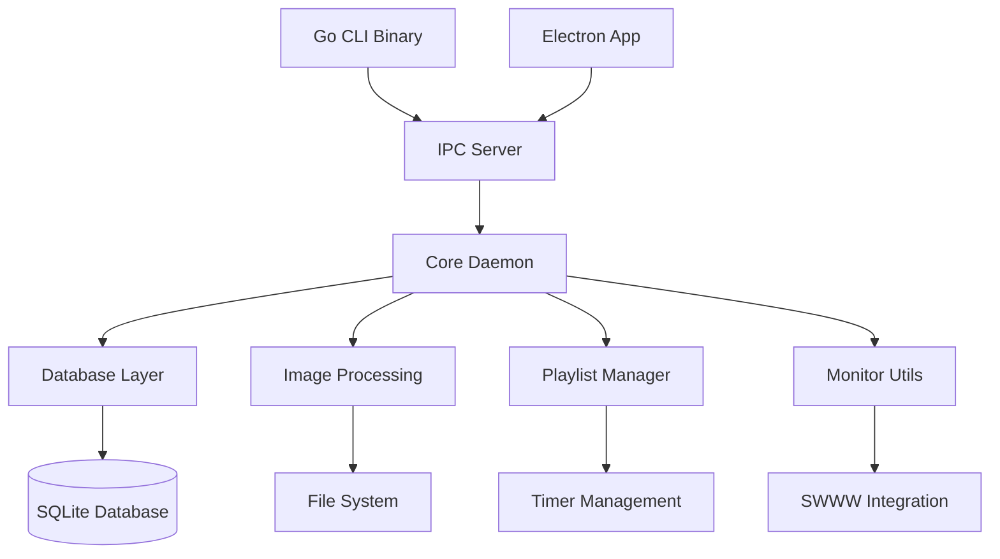

# Design Document

## Overview

This design outlines the complete rewrite of the waypaper-engine daemon from Node.js/TypeScript to Go. The new Go daemon will consolidate all image manipulation, database operations, and CLI functionality into a single, performant binary. The design maintains backward compatibility with the existing electron app while eliminating dependencies on drizzle, bashly, and sharp.

## Architecture

### High-Level Architecture



### Component Breakdown

The Go daemon will be structured as follows:

- **Main Daemon Process**: Entry point and lifecycle management
- **IPC Server**: Unix socket communication with electron app and CLI
- **Database Layer**: SQLite operations with native Go drivers
- **Image Processing**: Native Go image manipulation
- **Playlist Manager**: Wallpaper playlist execution logic
- **Monitor Utilities**: Display detection and management
- **CLI Application**: Separate binary for command-line operations

## Components and Interfaces

### 1. Main Daemon (`cmd/daemon/main.go`)

**Responsibilities:**
- Process lifecycle management
- Signal handling (SIGTERM, SIGINT, SIGHUP)
- Lock file management
- Component initialization and cleanup

**Key Functions:**
```go
func main()
func initializeComponents() error
func handleShutdown()
func acquireLock() bool
func releaseLock()
```

### 2. IPC Server (`internal/ipc/server.go`)

**Responsibilities:**
- Unix socket server management
- Message parsing and routing
- Connection handling
- Response serialization

**Key Interfaces:**
```go
type Server interface {
    Listen() error
    Close() error
    HandleConnection(conn net.Conn)
}

type MessageHandler interface {
    ProcessMessage(msg Message) (Response, error)
}
```

**Message Types:**
- Playlist operations (start, stop, pause, resume)
- Image operations (set, next, previous, random)
- System operations (info, history, config updates)

### 3. Database Layer (`internal/db/`)

**Responsibilities:**
- SQLite database connection management
- Schema migrations
- CRUD operations for all entities
- Query optimization

**Key Entities:**
- Images (metadata, paths, dimensions)
- Playlists (configuration, timing, order)
- Active Playlists (runtime state)
- Image History (usage tracking)
- Configuration (app and swww settings)

**Generated Queries (using sqlc):**
```go
type Queries struct {
    db *sql.DB
}

func (q *Queries) GetPlaylist(ctx context.Context, id int64) (Playlist, error)
func (q *Queries) ListImages(ctx context.Context) ([]Image, error)
func (q *Queries) InsertImageHistory(ctx context.Context, arg InsertImageHistoryParams) error
```

### 4. Image Processing (`internal/image/`)

**Responsibilities:**
- Image resizing and format conversion
- Thumbnail generation
- EXIF metadata extraction
- Multi-monitor image splitting
- Cache management

**Key Functions:**
```go
func ResizeImage(src io.Reader, width, height int, format string) ([]byte, error)
func ExtractMetadata(imagePath string) (ImageMetadata, error)
func GenerateThumbnail(imagePath string, size int) ([]byte, error)
func SplitImageForMonitors(imagePath string, monitors []Monitor) ([]MonitorImage, error)
func CreateExtendedImage(imagePath string, totalWidth, totalHeight int) (string, error)
```

**Image Libraries:**
- `image/jpeg`, `image/png`, `image/gif` for basic operations
- `golang.org/x/image` for advanced format support
- `github.com/disintegration/imaging` for resizing algorithms

### 5. Playlist Manager (`internal/playlist/`)

**Responsibilities:**
- Playlist execution logic
- Timer management
- Image scheduling
- Event-driven playlist types (time of day, day of week)

**Key Types:**
```go
type Manager struct {
    playlists map[string]*PlaylistInstance
    db        *db.Queries
    imageProc *image.Processor
}

type PlaylistInstance struct {
    ID           int64
    Name         string
    Type         PlaylistType
    Images       []Image
    CurrentIndex int
    Timer        *time.Timer
    ActiveMonitor ActiveMonitor
}

type PlaylistType int
const (
    Timer PlaylistType = iota
    Never
    TimeOfDay
    DayOfWeek
)
```

### 6. Monitor Utilities (`internal/monitor/`)

**Responsibilities:**
- Monitor detection via swww
- Resolution and position tracking
- Multi-monitor configuration
- Display change monitoring

**Key Functions:**
```go
func GetMonitors() ([]Monitor, error)
func SetWallpaper(imagePath string, monitor string, config SwwwConfig) error
func BuildSwwwCommand(imagePath, monitor string, config SwwwConfig) []string
func MonitorDisplayChanges() <-chan []Monitor
```

### 7. CLI Application (`cmd/cli/main.go`)

**Responsibilities:**
- Command-line argument parsing
- IPC communication with daemon
- Interactive playlist selection
- User-friendly output formatting

**Command Structure:**
```go
type Command interface {
    Execute(args []string) error
}

type Commands struct {
    Run           *RunCommand
    Daemon        *DaemonCommand
    NextImage     *NextImageCommand
    PreviousImage *PreviousImageCommand
    // ... other commands
}
```

## Data Models

### Core Data Structures

```go
type Image struct {
    ID       int64  `json:"id"`
    Name     string `json:"name"`
    Width    int    `json:"width"`
    Height   int    `json:"height"`
    Format   string `json:"format"`
    IsChecked bool  `json:"isChecked"`
    IsSelected bool `json:"isSelected"`
}

type Playlist struct {
    ID                     int64         `json:"id"`
    Name                   string        `json:"name"`
    Type                   string        `json:"type"`
    Interval               sql.NullInt64 `json:"interval"`
    ShowAnimations         bool          `json:"showAnimations"`
    AlwaysStartOnFirstImage bool         `json:"alwaysStartOnFirstImage"`
    Order                  string        `json:"order"`
    CurrentImageIndex      int64         `json:"currentImageIndex"`
}

type ActiveMonitor struct {
    Name                string    `json:"name"`
    Monitors           []Monitor `json:"monitors"`
    ExtendAcrossMonitors bool     `json:"extendAcrossMonitors"`
}

type Monitor struct {
    Name     string   `json:"name"`
    Width    int      `json:"width"`
    Height   int      `json:"height"`
    Position Position `json:"position"`
    CurrentImage string `json:"currentImage"`
}
```

### Message Protocol

```go
type Message struct {
    Action        string         `json:"action"`
    Playlist      *PlaylistInfo  `json:"playlist,omitempty"`
    Image         *Image         `json:"image,omitempty"`
    ActiveMonitor *ActiveMonitor `json:"activeMonitor,omitempty"`
    Monitors      []string       `json:"monitors,omitempty"`
}

type Response struct {
    Action string      `json:"action"`
    Data   interface{} `json:"data,omitempty"`
    Error  string      `json:"error,omitempty"`
}
```

## Error Handling

### Error Categories

1. **System Errors**: File system, network, permissions
2. **Database Errors**: Connection, query, constraint violations
3. **Image Processing Errors**: Corrupt files, unsupported formats
4. **IPC Errors**: Communication failures, protocol violations
5. **Configuration Errors**: Invalid settings, missing files

### Error Handling Strategy

```go
type DaemonError struct {
    Type    ErrorType `json:"type"`
    Message string    `json:"message"`
    Code    int       `json:"code"`
    Details map[string]interface{} `json:"details,omitempty"`
}

type ErrorType string
const (
    SystemError     ErrorType = "system"
    DatabaseError   ErrorType = "database"
    ImageError      ErrorType = "image"
    IPCError        ErrorType = "ipc"
    ConfigError     ErrorType = "config"
)
```

### Logging Strategy

- **Structured logging** using `slog` package
- **Log levels**: DEBUG, INFO, WARN, ERROR
- **Log rotation** for production deployments
- **Context propagation** for request tracing

## Testing Strategy

### Unit Testing

- **Database layer**: Mock database for isolated testing
- **Image processing**: Test with known image samples
- **Playlist logic**: Mock timers and time-based operations
- **IPC protocol**: Mock connections and message handling

### Integration Testing

- **End-to-end workflows**: Complete playlist execution cycles
- **Database migrations**: Schema version compatibility
- **Multi-monitor scenarios**: Various display configurations
- **Error recovery**: Daemon restart and state restoration

### Performance Testing

- **Image processing benchmarks**: Large image handling
- **Database query performance**: Complex playlist queries
- **Memory usage**: Long-running daemon stability
- **Concurrent operations**: Multiple playlist execution

### Test Structure

```go
func TestPlaylistManager_StartTimerPlaylist(t *testing.T) {
    // Setup mock dependencies
    mockDB := &MockQueries{}
    mockImageProc := &MockImageProcessor{}
    
    manager := NewPlaylistManager(mockDB, mockImageProc)
    
    // Test execution
    err := manager.StartPlaylist(context.Background(), playlistID)
    
    // Assertions
    assert.NoError(t, err)
    assert.True(t, manager.IsPlaylistActive(playlistID))
}
```

## Migration Strategy

### Phase 1: Core Infrastructure
- Database layer with sqlc-generated queries
- Basic IPC server with message routing
- Image processing foundation
- CLI argument parsing

### Phase 2: Playlist Functionality
- Timer-based playlists
- Image setting and rotation
- Monitor detection and management
- Basic error handling

### Phase 3: Advanced Features
- Time-based and day-based playlists
- Image history and caching
- Configuration management
- Performance optimizations

### Phase 4: Integration and Testing
- Electron app integration
- Comprehensive testing
- Documentation and deployment
- Legacy system removal

## Performance Considerations

### Memory Management
- **Image buffer pooling** to reduce GC pressure
- **Streaming image processing** for large files
- **Cache size limits** with LRU eviction
- **Goroutine lifecycle management**

### Concurrency
- **Worker pools** for image processing
- **Channel-based communication** between components
- **Context cancellation** for graceful shutdowns
- **Mutex protection** for shared state

### Database Optimization
- **Connection pooling** with configurable limits
- **Prepared statements** for frequent queries
- **Batch operations** for bulk inserts
- **Index optimization** for common query patterns

## Security Considerations

### File System Access
- **Path validation** to prevent directory traversal
- **Permission checks** before file operations
- **Sandboxed image processing** to prevent exploits
- **Temporary file cleanup** to prevent disk filling

### IPC Security
- **Unix socket permissions** (600 or 660)
- **Message size limits** to prevent DoS
- **Input validation** for all message fields
- **Rate limiting** for command execution

### Process Security
- **Privilege dropping** after initialization
- **Signal handling** for clean shutdowns
- **Resource limits** (memory, file descriptors)
- **Crash recovery** with state restoration