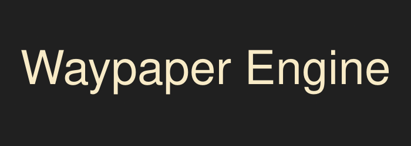
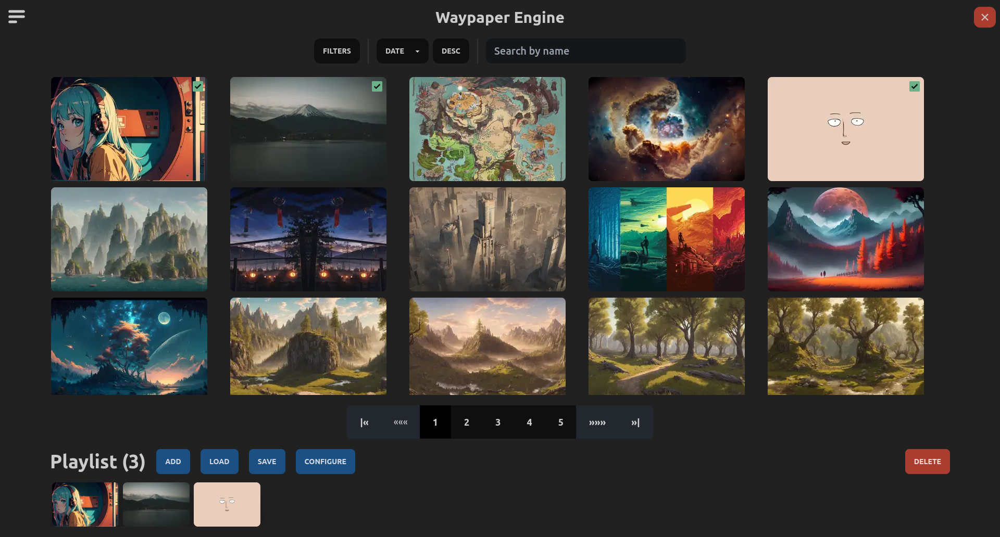
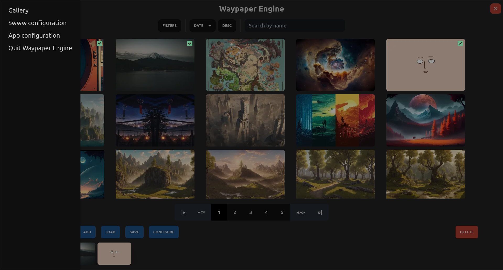
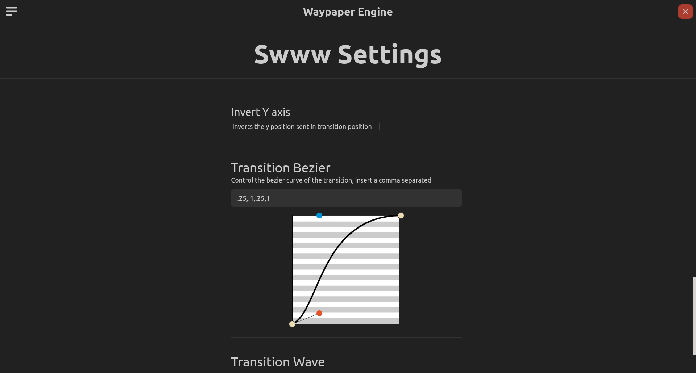
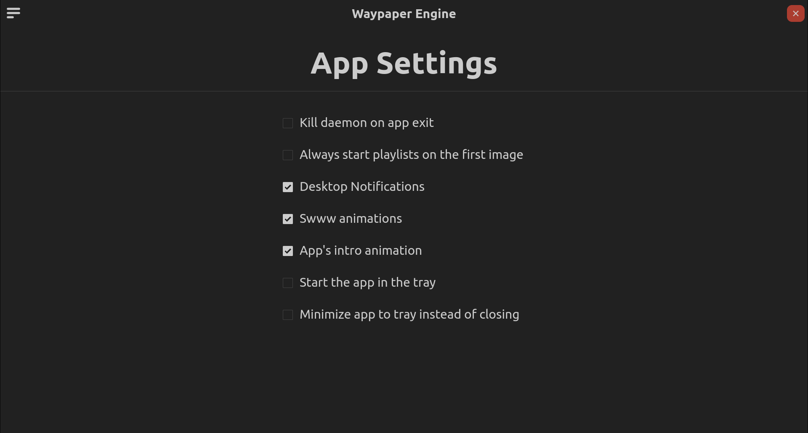

  

  
A graphical frontend for setting wallpapers and playlists, using swww under the hood!

---

[<kbd>   How to install   </kbd>](#Install)

---

# Features

- Multimonitor support.
- Four different types of playlists (Time of day, weekly,interval based or static).
- Easy configuration of all swww options.
- Tray controls.
- CLI tool included that serves as a player for playlists, with the basic commands.
- All of Swww features such as wallpaper change animations and wallpaper persistance through reboots.
- Filter by format, resolution,name,etc.
   
   

---

---

[multimonitor_example.webm](https://github.com/0bCdian/Waypaper-Engine/assets/101421807/3e502407-6f35-48ea-af7e-73d42b88c9ba)

# Install

1) Install swww and nodejs if you haven't already from the arch linux repository.
>[!IMPORTANT] 
>``yay -S nodejs swww``
2) Clone this repo or download this repo
3) cd into the repo directory and execute the install.sh script.
4) Done!

# Gallery

---

---

---

