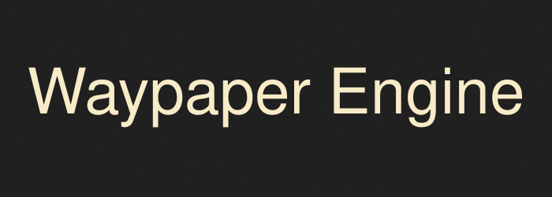

<div align="center">
  


### _A wallpaper setter gui, developed with ricing in mind!_ 🍚

**[<kbd> <br> Why <br>  </kbd>](#why)**
**[<kbd> <br> How to install <br> </kbd>](#install)**
**[<kbd> <br> Usage <br> </kbd>](#usage)**
**[<kbd> <br> TODO <br> </kbd>](#todo)**
**[<kbd> <br> Gallery <br> </kbd>](#gallery)**
**[<kbd> <br> Special Thanks <br> </kbd>](#special-thanks)**

</div>

> [!IMPORTANT]
> **Project Status:** This project was inactive for a while as I moved into a DevOps engineering role and didn't have the time to maintain it. I've recently come back to active development and the project is undergoing a major rewrite. **Waypaper Engine is not abandoned or archived** — it's being rebuilt from the ground up with a new Go daemon backend, pluggable wallpaper backend support, and a modernized UI. The current `main` branch reflects the older codebase; the rewrite is happening on the `refactor/wayaper-daemon` branch and will be merged once stable. Expect breaking changes, new features, and updated install instructions when the rewrite lands.

# What's New (v2 Rewrite)

The rewrite replaces the old Node.js backend with a Go daemon and overhauls the frontend. Here's what's been implemented so far:

### Architecture
-   **Go daemon backend** — A standalone Go service that handles all wallpaper, playlist, image, and monitor operations over a Unix socket HTTP API. Replaces the old Node.js/SQLite backend entirely.
-   **Pluggable wallpaper backends** — Support for [swww](https://github.com/LGFae/swww), [hyprpaper](https://github.com/hyprwm/hyprpaper), and [feh](https://feh.finalrewind.org/), with a registry that allows runtime switching. No longer locked to swww.
-   **CloverDB storage** — Lightweight embedded database replacing SQLite, managed entirely by the daemon.
-   **Server-Sent Events (SSE)** — Real-time event streaming from daemon to frontend for image processing progress, wallpaper changes, playlist updates, and config changes.
-   **Cobra CLI** — Full CLI (`start`, `stop`, `status`, `set`, `random`, `next`, `previous`, image/playlist/monitor/backend/config management) that talks to the running daemon over the socket.

### Features
-   **Image renaming** — Rename images from the gallery (inline or detail sidebar), with automatic deduplication and physical file rename on disk. Playlists are unaffected since they reference images by stable IDs.
-   **Wallhaven integration** — Search, browse, and download wallpapers from [Wallhaven](https://wallhaven.cc/) directly into your gallery.
-   **URL/drag-and-drop import** — Drop image URLs or files onto the window to import them. HTTP(S) URLs are downloaded automatically.
-   **Image detail sidebar** — View metadata, edit tags with autocomplete, and rename images from a slide-over panel.
-   **Context menus** — Right-click context menus throughout the gallery with wallpaper setting, playlist management, selection, rename, delete, and file manager integration.
-   **Multi-resolution thumbnails** — Automatic thumbnail generation at multiple resolutions (720p, 1080p, 1440p, 4K) for fast gallery rendering.
-   **Monitor auto-detection** — Native detection via hyprctl, swaymsg, wlr-randr, or xrandr depending on the compositor, with manual override support.
-   **Wallpaper history** — Per-monitor history log with forward/back navigation.

### UI
-   **Neobrutalist design mode** — Optional design mode with configurable shadow offsets, border widths, corner radius, and polaroid-style image cards. Toggleable alongside the standard DaisyUI look.
-   **Expanded theme library** — 30+ themes including Gruvbox, Catppuccin, Tokyo Night, Nord, Dracula, Rosé Pine, Everforest, and more, on top of all DaisyUI built-in themes.
-   **Modernized layout** — Drawer-based navigation with sidebar, image processing progress overlay, toast notifications, and confirm dialogs.

# Legacy Features

These features carry over from the original version:

-   Multi monitor support.
-   Four different types of playlists (Time of day, daily, interval based or static).
-   Tray controls.
-   Filter images by format, resolution, name, etc.

---


https://github.com/0bCdian/Waypaper-Engine/assets/101421807/4d49225a-cbdc-42a0-af67-aac823c47f98

---

# Why

I started this project for two main reasons, one as a learning oportunity, and two because the available options for a tool like this didn't suit my needs fully. I really like [swww](https://github.com/Horus645/swww) but it lacks a lot of the features that I missed from wallpaper engine in windows, so this is my attempt to bridge that gap a little.

# Install

## Arch Linux (AUR)

```bash
yay -S waypaper-engine
```

or the git version:

```bash
yay -S waypaper-engine-git
```

Both the normal and -git version conflict with each other, so make sure to delete the other with `yay -Rns package_name package_name-debug` before installing either.

## Manual Install (any distro)

Prerequisites: `git`, `go` (1.22+), `node` (18+), `npm`

```bash
git clone https://github.com/0bCdian/Waypaper-Engine.git
cd Waypaper-Engine
make deps
make daemon
make electron
sudo make install
```

Build and install are intentionally separate:
- Build artifacts with `make daemon` and `make electron` (or `make build`)
- Install prebuilt artifacts with `sudo make install`

This installs:
- Go daemon binary: `/usr/local/bin/waypaper-daemon`
- Electron app (unpacked): `/opt/waypaper-engine`
- Launcher: `/usr/local/bin/waypaper-engine`
- Desktop entry/icon: `/usr/local/share/...`

The `waypaper-engine` launcher is a single entrypoint:
- `waypaper-engine` (or `waypaper-engine run`) launches the GUI
- `waypaper-engine daemon <args>` forwards to daemon CLI
- `waypaper-engine <args>` also forwards to daemon CLI commands directly

Run `make help` to see all available targets.

To uninstall:

```bash
sudo make uninstall
```

Use `PREFIX` and/or `DESTDIR` to customize install locations:

```bash
sudo make install PREFIX=/usr
make install DESTDIR="$PWD/pkgroot" PREFIX=/usr/local
```

## AppImage (build + system install)

```bash
git clone https://github.com/0bCdian/Waypaper-Engine.git
cd Waypaper-Engine
make deps
make appimage
```

The resulting AppImage is created in `release/`.

Release-downloaded `.AppImage` artifacts are intended for GUI use (double-click / run directly). The daemon is bundled and started internally by the app, so no separate daemon CLI setup is required for this mode. Packaged builds intentionally do not fall back to a system `waypaper-daemon`.

Install that AppImage system-wide with:

```bash
make appimage
sudo make install-appimage
```

`install-appimage` installs an existing artifact from `release/` and does not build one.

This installs:
- AppImage binary: `/opt/waypaper-engine-appimage/waypaper-engine.AppImage`
- Launcher: `/usr/local/bin/waypaper-engine-appimage`
- Desktop entry: `/usr/local/share/applications/waypaper-engine-appimage.desktop`

To remove the AppImage install:

```bash
sudo make uninstall-appimage
```

## Other Formats

See [packaging/README.md](packaging/README.md) for RPM (Fedora), Snap, and instructions on adding new packaging formats.

# Usage

Simply start the app and add wallpapers to the gallery, from there you can double click to set the wallpapers or right click for more options, to create playlists simply click on the checkboxes that appear when hover over the images, and configure it, and then save it to auto start it.

# Examples

### Autostart on hyprland just the daemon

Add to your hyprland.conf the following lines:

```bash
exec-once=waypaper-engine daemon
```

### Add scripts to run on each image set

> [!WARNING]
> Make sure the script in question has execution permissions by using `chmod +x scriptname.sh`
> Put you bash scripts in this path:

```bash
$HOME/.waypaper_engine/scripts
```

The scripts are always passsed as an argument the path of the image being set, so you can do stuff like this:


https://github.com/0bCdian/Waypaper-Engine/assets/101421807/f454a904-7fa7-4ce9-86e9-f8fbc86e8c2b

# TODO

-   [ ] Add testing.
-   [ ] Have a ci/cd pipeline.
-   [x] Implement a logger for errors.
-   [x] Publish in the aur.
-   [x] Find a good icon/logo for the app (Thank you [Cristian Avendaño](https://github.com/c-avendano)!).
-   [ ] Add flatpak support.
-   [x] Add scripts feature.
-   [x] Add playlists per monitor.

_If you encounter any problems or would like to make a suggestion, please feel free to open an issue_.

# Gallery


# Special Thanks

**[LGFae](https://github.com/LGFae)** - _for the amazing little tool that swww is !_ ❤️

**[Simon Ser](https://git.sr.ht/~emersion/)** - _for wlr-randr, without it making this work across different wayland wm's would've been a nightmare_ 🥲

**[Cristian Avendaño](https://github.com/c-avendano)** - _for creating the amazing logo!_ 💪
