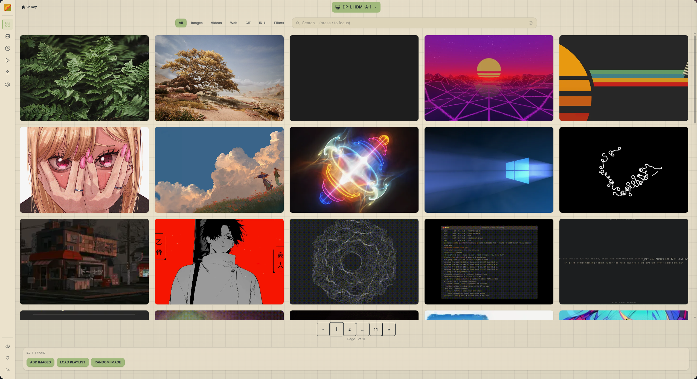
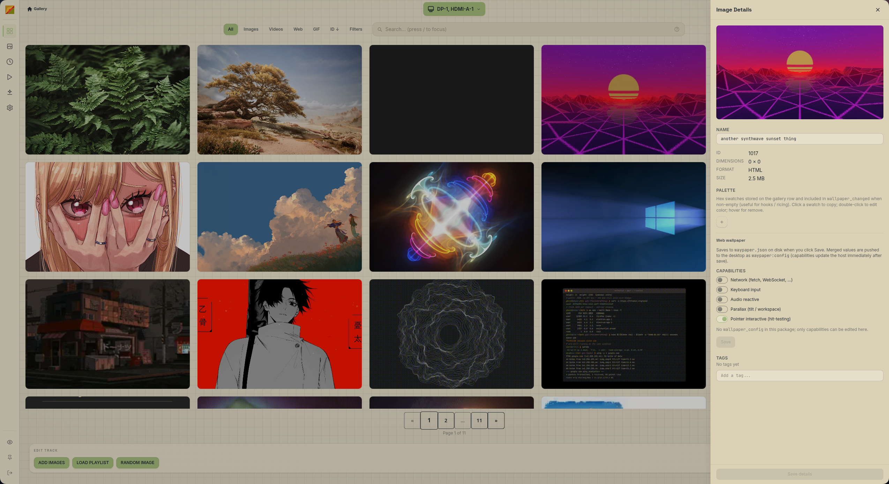
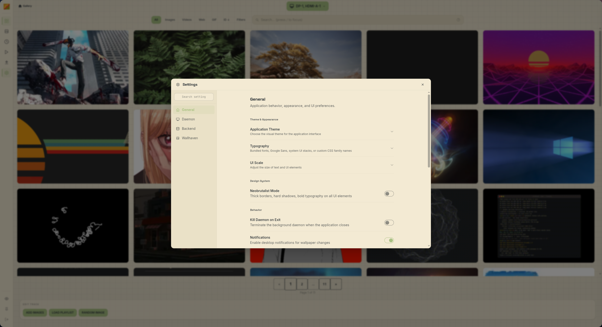
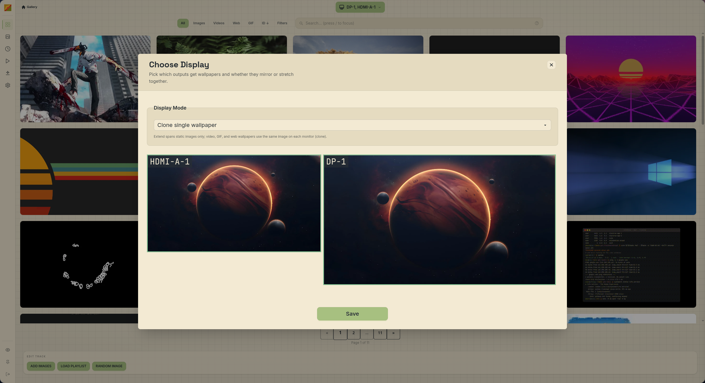

<div align="center">


### _A wallpaper setter GUI, developed with ricing in mind!_ 🍚

[](LICENSE)
[](https://github.com/0bCdian/Waypaper-Engine/commits)
[](https://aur.archlinux.org/packages/waypaper-engine)
[](https://github.com/0bCdian/Waypaper-Engine/stargazers)
[]()
[]()

**[Overview](#overview) · [What's new in v3](#whats-new-in-v3) · [Features](#features) · [Install](#install) · [Usage](#usage) · [Gallery](#screenshots) · [Star history](#star-history) · [Thanks](#special-thanks)**

</div>

**Docs in-repo:** [Daemon HTTP API](daemon/API_CONTRACT.md) · [Daemon architecture](daemon/docs/ARCHITECTURE.md) · [Packaging / `DESTDIR`](packaging/README.md) · **handbook (VitePress):** run `npm run docs:dev` locally, or after enabling **GitHub Pages → GitHub Actions**, the site is published from the **Docs** workflow (default base path `/Waypaper-Engine/` → `https://0bCdian.github.io/Waypaper-Engine/`)

_This project is developed with help from **LLM-based coding tools**; I still review, test, and ship what I stand behind._

---

## Overview

I wanted a Linux wallpaper app that **feels** like part of a rice: a real gallery, playlists that make sense, and a control plane that does not get in the way. **Waypaper Engine 3** pairs an **Electron** UI with a **Go daemon** on **Wayland and X11**. The UI and anything else you build talk to the daemon over a **Unix socket** (JSON HTTP); live updates (imports, playlists, wallpaper changes, config) stream over **Server-Sent Events** on `GET /events`—no more ad hoc shell hooks for automation.

Pluggable **backends** do the real wallpaper work: [awww](https://github.com/LGFae/awww), [hyprpaper](https://github.com/hyprwm/hyprpaper), [feh](https://feh.finalrewind.org/), [mpvpaper](https://github.com/GhostNaN/mpvpaper), or **[wayland-utauri](https://github.com/0bCdian/wayland-utauri)** for HTML and video on Wayland. Library data and history live in **CloverDB** on the daemon side. You can still browse and pull from [Wallhaven](https://wallhaven.cc/) inside the app.

> [!NOTE]
> **HTML / video (wayland-utauri):** outbound network stays **off** until you turn on the global allow flag **and** the wallpaper manifest sets **`capabilities.network`**. Read [wayland-utauri’s web wallpaper spec](https://github.com/0bCdian/wayland-utauri/blob/main/docs/WEB_WALLPAPER_SPEC.md) if you’re shipping HTML walls.

---

## What's new in v3

The big shift is replacing the old **Node.js** backend with a **Go daemon**: one process owns gallery state, playlist scheduling, image processing, and backend orchestration. It exposes a **chi** HTTP router on the socket, a **Cobra** CLI for the same operations the GUI uses, a **pub/sub event bus** wired to **SSE** (`wallpaper_changed`, `playlist_*`, `images_updated`, `config_changed`, and more—see the contract), and pluggable **Go** `backend` packages instead of stringing together shell and legacy glue. Storage moved to **CloverDB**; the stack is easier to test and reason about than the monolithic Node era.

**UI/UX** got a full pass: drawer layout, **font presets** and expanded **themes** (including neobrutalist / “neo” gallery styling), clearer settings (backend **auto** mode and priority lists), better gallery empty states, filters, and **studio** routes that use the full viewport. Two new tools—**Looper Studio** and **Shader Studio**—sit on top of that (both **beta**; expect rough edges).

---

## Features

- **Pluggable backends** — awww, hyprpaper, feh, mpvpaper, or wayland-utauri; auto mode can pick a working backend from a priority list.
- **Gallery-first workflow** — Multi-resolution thumbs, detail sidebar (tags, metadata, rename on disk; playlists keep stable image IDs).
- **Playlists with rules** — Time-of-day, daily, interval, or static; per-monitor where it makes sense; daemon-side scheduler with clear SSE when things change.
- **Wallhaven** — Search, favorites, and downloads into the library from inside the app.
- **Drag and drop (and pickers)** — Drop **images** (e.g. JPG, PNG, GIF, WebP, BMP, SVG, TIFF), **videos** (e.g. MP4, WebM, MKV, MOV), **folders**, a **`waypaper.json` / `project.json`** web wallpaper manifest, or an **`https://` URL**; Shadertoy **`.json`** exports can open in Shader Studio. Imports report progress over SSE.
- **Wallpaper history** — Per-monitor back/forward.
- **Integrations** — Connect your own tool to the daemon and subscribe to **`GET /events`** (SSE) for structured updates (e.g. `wallpaper_changed`). Details and payloads: [API contract / SSE](daemon/API_CONTRACT.md#server-sent-events-sse).
- **CLI** — Cobra entrypoints for `start`, `stop`, `status`, set/random/next/prev, and config—same state as the GUI.

**Looper Studio (beta)** — `loop-studio` — Set **in/out** on videos from the library (or an allowed YouTube flow where supported), **compare** loop points, optional **ffmpeg** export to WebM/VP9 (or import the result as a new gallery item). Built for turning clips into clean loops without leaving Waypaper.

**Shader Studio (beta)** — `shader-studio` — Author or **import Shadertoy** `.json` (including multipass), run live **WebGL2** preview, and **save** a packaged web wallpaper into the gallery.

**Tray** and **DaisyUI**-based theming (including a long ricing-friendly list + neo styling) are still part of the vibe.

---

## Tech stack

| Area          | What                                                                                                        |
| ------------- | ----------------------------------------------------------------------------------------------------------- |
| App shell     | Electron 40, React 19, Vite 6, Tailwind 4, DaisyUI 5                                                        |
| Daemon        | Go 1.26, [chi](https://github.com/go-chi/chi), [CloverDB](https://github.com/ostafen/clover), Cobra + Viper |
| IPC           | Unix socket HTTP, Server-Sent Events                                                                        |
| Dev toolchain | Node 22, **mise** (see [.mise.toml](.mise.toml)), oxfmt / oxlint, Vitest, Playwright (e2e)                  |

---

## Install

The Makefile is the source of truth. **Packaging and `DESTDIR`:** read [packaging/README.md](packaging/README.md).

**Be advised** — no backend is required to start the app. If none is installed, Waypaper Engine starts in degraded mode and shows a banner pointing you to the [install guide](https://0bCdian.github.io/Waypaper-Engine/guide/install.html). Once you install a backend and it lands on `PATH`, the banner clears on its own.

**Simply clone and install locally:**

```bash
git clone https://github.com/0bCdian/Waypaper-Engine.git
cd Waypaper-Engine
make deps && make electron && make install
```

**Simply install on Arch (AUR):**

```bash
yay -S waypaper-engine
# or: yay -S waypaper-engine-git
```

**Portable AppImage:** grab `*.AppImage` from [Releases](https://github.com/0bCdian/Waypaper-Engine/releases), `chmod +x`, and run—the daemon is bundled there.

> [!WARNING]
> The daemon uses a Unix socket at `$XDG_RUNTIME_DIR/waypaper-engine.sock`. If the app won’t start after a crash, delete the stale socket and try again.

---

## Usage

Start **Waypaper Engine** from your app menu or `waypaper-engine` on the path you installed to. Add images to the gallery, **double-click** to set, **right-click** for the full menu, and use hover checkmarks to build **playlists**. Configure playlist rules in the sidebar and save—done.

**Daemon only (e.g. Hyprland autostart):**

```bash
exec-once=waypaper-engine daemon
```

If you want a script when a wallpaper changes, **subscribe to the daemon**: any HTTP client that can speak to the **Unix socket** (e.g. `curl --unix-socket "$XDG_RUNTIME_DIR/waypaper-engine.sock" http://localhost/events`) and read the **SSE** stream, or a small Go/Python helper. The event types and JSON payloads are in [daemon/API_CONTRACT.md](daemon/API_CONTRACT.md#server-sent-events-sse).

---

## Development

Tool versions are pinned in [.mise.toml](.mise.toml). Install [mise](https://mise.jdx.dev/), then from a clone of the repo:

```bash
cd Waypaper-Engine
mise install
npm install
npm run dev
```

**Before opening a PR:**

```bash
npm run ci:check
```

| Script                | What                                                           |
| --------------------- | -------------------------------------------------------------- |
| `npm run dev`         | Daemon + UI in dev: daemon build first, then Vite and Electron |
| `npm run build`       | Production build: daemon, Vite bundle, electron-builder        |
| `npm test`            | Vitest for the renderer                                        |
| `npm run test:daemon` | Go tests under `daemon/`                                       |
| `npm run test:e2e`    | Playwright e2e; uses a built daemon and browser                |

**Layout (high level):**

```
Waypaper-Engine/
├── daemon/          # Go service: HTTP API, backends, storage
├── src/             # React UI
├── electron/        # Electron main/preload
├── shared/          # Shared TS types and helpers
├── e2e/             # Playwright tests
└── packaging/       # Distro / AppImage notes
```

**Daemon control-plane refactor** — Checklist and design: [`daemon/docs/control-refactor-plan.md`](daemon/docs/control-refactor-plan.md). Config and backend activation policy: [`daemon/internal/control`](daemon/internal/control) (`Controller`). Wallpaper restore: [`daemon/internal/wallpaper`](daemon/internal/wallpaper) (`Restore`, `StartDeferredDaemonRestore`). **GET/PATCH `/config/backend`** is removed; use **`/config/backends/{backend}`** (see [API contract](daemon/API_CONTRACT.md)).

---

## Roadmap (informal)

- [ ] Flatpak
- [x] Tests and CI-style checks
- [x] Logging that doesn’t hide failures
- [x] AUR packages
- [x] App icon (huge love to the designer in [Thanks](#special-thanks))
- [x] Per-monitor playlists (where the backend allows)

_If something breaks or you have an idea, open an issue—I read them._

---

## Screenshots

_v3.0 UI — images live in [`readme_files/3.0/`](readme_files/3.0/)_

| Gallery                                    | Image details                                    |
| ------------------------------------------ | ------------------------------------------------ |
|  |  |

| Settings                                          | Monitors                                          |
| ------------------------------------------------- | ------------------------------------------------- |
|  |  |

---

## Star history

[](https://www.star-history.com/#0bCdian/Waypaper-Engine&Date)

_If the app saves you a headache, a star on the repo means a lot._

---

## Special Thanks

**[LGFae](https://github.com/LGFae)** — _awww is tiny and does exactly what I need—thank you_ ❤️

**[Rajveer Malviya](https://github.com/rajveermalviya)** — _go-wayland made native Wayland monitor detection possible without shelling out_ 🥲

**[Cristian Avendaño](https://github.com/c-avendano)** — _the logo and icon that make the app feel like a real product_ 💪

---

## License

See [LICENSE](LICENSE).
