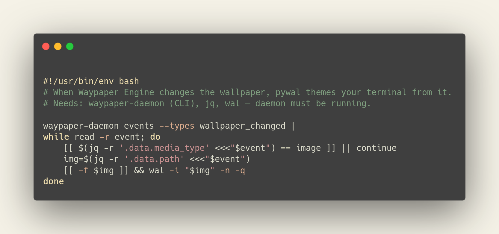
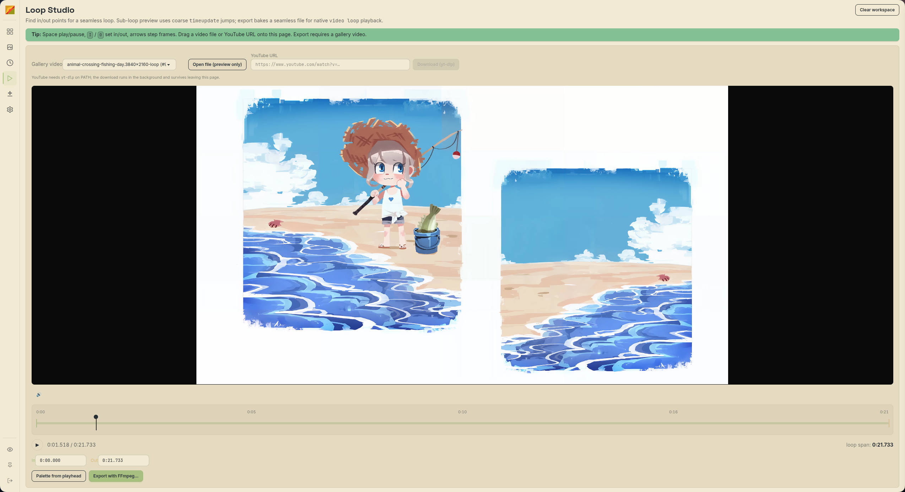
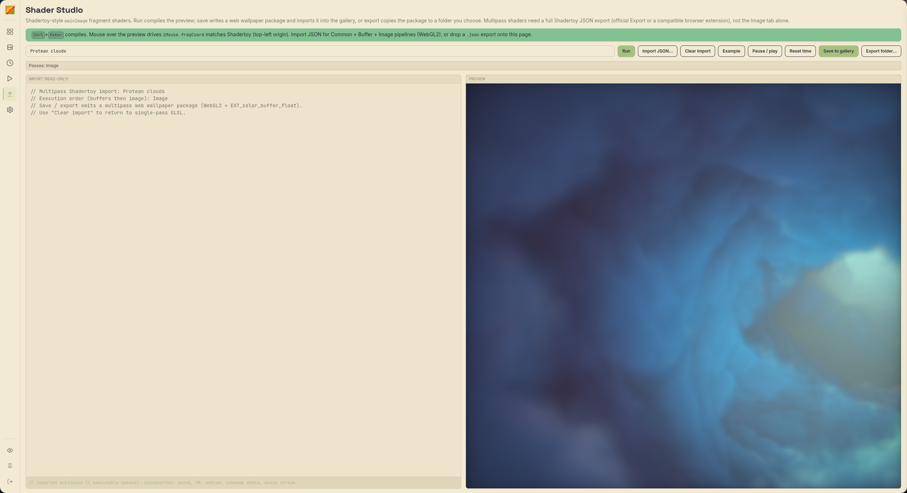
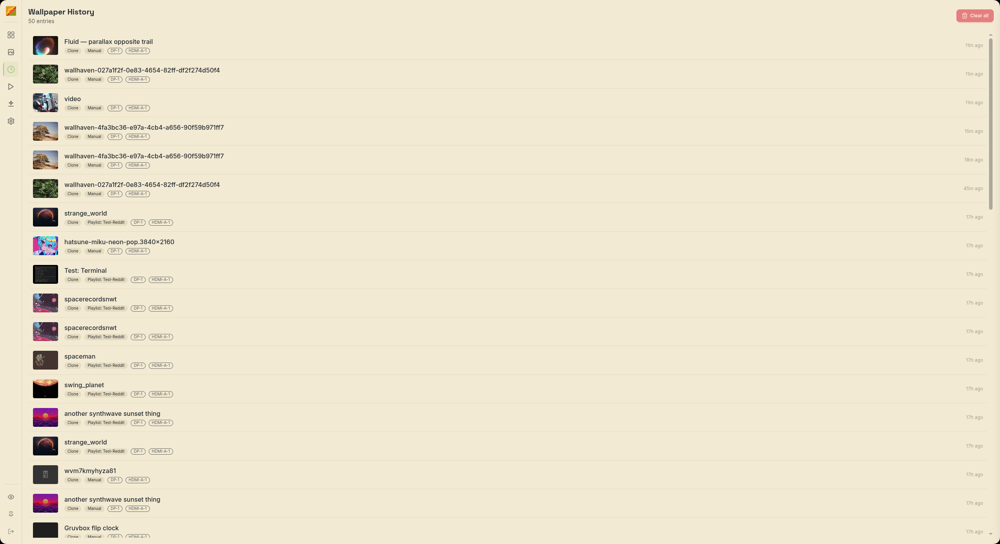

<div align="center">


### _A wallpaper setter GUI, developed with ricing in mind!_ 🍚

[](LICENSE)
[](https://github.com/0bCdian/Waypaper-Engine/commits)
[](https://aur.archlinux.org/packages/waypaper-engine)
[](https://github.com/0bCdian/Waypaper-Engine/stargazers)
[]()
[]()

**[Overview](#overview) · [What's new in v3](#whats-new-in-v3) · [Features](#features) · [Install](#install) · [Usage](#usage) · [Gallery](#screenshots) · [Star history](#star-history) · [Thanks](#special-thanks)**

</div>

_Disclaimer: This project is developed with help from **LLM-based coding tools**._

---

## Overview

This is a wallpaper manager at its core—its job is to create playlists and help you navigate / curate your gallery. It has features like advanced filters, support for different types of wallpapers (static images, gifs, videos, html web wallpapers), download from youtube, import shadertoy animations into web wallpapers, direct wallhaven integration, and so much more!

---

## What's new in v3

The big shift is replacing the old **Node.js** backend with a **Go daemon**: one process owns gallery state, playlist scheduling, image processing, and backend orchestration. It exposes a **chi** HTTP router on the socket, a **Cobra** CLI for the same operations the GUI uses, a **pub/sub event bus** wired to **SSE** (`wallpaper_changed`, `playlist_*`, `images_updated`, `config_changed`, and more—see the contract), and pluggable **Go** `backend` packages instead of stringing together shell and legacy glue. Storage moved to **CloverDB**;

**UI/UX** got a full pass: drawer layout, **font presets** and expanded **themes** (including neobrutalist / “neo” gallery styling), clearer settings (backend **auto** mode and priority lists), better gallery empty states, filters, and **studio** routes that use the full viewport. Two new tools—**Looper Studio** and **Shader Studio**—sit on top of that (both **beta**; expect rough edges).

---

## Features

- **Multiple backends** — awww, hyprpaper, swaybg, feh, mpvpaper, or wal-qt; auto mode can pick a working backend from a priority list. More to come if requested!
- **Beautiful Gallery** — Multi-resolution thumbs, detail sidebar (tags, metadata, rename on disk; playlists keep stable image IDs), folders, advanced filters, and so much more!
- **Playlists** — Time-of-day, daily, interval, or static; per-monitor;
- **Wallhaven** — Search, favorites, and downloads into the library from inside the app.
- **Drag and drop (and pickers)** — Drop **images** (e.g. JPG, PNG, GIF, WebP, BMP, SVG, TIFF), **videos** (e.g. MP4, WebM, MKV, MOV), **folders**, a **`waypaper.json` / `project.json`** web wallpaper manifest, or an **`https://` URL**; Shadertoy **`.json`** exports can open in Shader Studio.
- **Wallpaper history** — Per-monitor back/forward.
- **Integrations** — Connect your own tool to the daemon and subscribe to **`GET /events`** (SSE) for structured updates (e.g. `wallpaper_changed`).
- **CLI** — Cobra entrypoints for `start`, `stop`, `status`, set/random/next/prev, and config—same state as the GUI.

- **Looper Studio (beta)** — `loop-studio` — Set **in/out** on videos from the library (or an allowed YouTube flow where supported), optional **ffmpeg** export to WebM/VP9 (or import the result as a new gallery item). Built for turning clips into clean loops without leaving Waypaper.

- **Shader Studio (beta)** — `shader-studio` — Author or **import Shadertoy** `.json` (including multipass), run live **WebGL2** preview, and **save** a packaged web wallpaper into the gallery.

- **DaisyUI**-based theming (including a long ricing-friendly list + neo styling) are still part of the vibe.

---

## Tech stack

| Area          | What                                                                                                        |
| ------------- | ----------------------------------------------------------------------------------------------------------- |
| App shell     | Electron 40, React 19, Vite 6, Tailwind 4, DaisyUI 5                                                        |
| Daemon        | Go 1.26, [chi](https://github.com/go-chi/chi), [CloverDB](https://github.com/ostafen/clover), Cobra + Viper |
| IPC           | Unix socket HTTP, Server-Sent Events                                                                        |
| Dev toolchain | Node 22, **pnpm** 9, **mise** (see [.mise.toml](.mise.toml)), oxfmt / oxlint, Vitest, Playwright (e2e)                  |

---

## Install

The Makefile is the source of truth. **Packaging and `DESTDIR`:** read [packaging/README.md](packaging/README.md).

**Be advised** — no backend is required to start the app. If none is installed, Waypaper Engine starts in degraded mode and shows a banner pointing you to the [install guide](https://0bCdian.github.io/Waypaper-Engine/guide/install.html). Once you install a backend and it lands on `PATH`, the banner clears on its own.

**Simply clone and install locally:**

```bash
git clone https://github.com/0bCdian/Waypaper-Engine.git
cd Waypaper-Engine
make deps && make electron && make install
```

**Simply install on Arch (AUR):**

```bash
yay -S waypaper-engine
# or: yay -S waypaper-engine-git
```

**Portable AppImage:** grab `*.AppImage` from [Releases](https://github.com/0bCdian/Waypaper-Engine/releases), `chmod +x`, and run—the daemon is bundled there.

---

## Usage

Start **Waypaper Engine** from your app menu, or run `waypaper-engine` if you installed the launcher on your `PATH`. Add images to the gallery, **double-click** to set one, **right-click** for the full menu, and use the hover checkmarks to build **playlists**. Set the playlist rules in the sidebar, save, and you're done.

**Daemon only (e.g. Hyprland autostart):** the GUI isn't required—the `waypaper-daemon` CLI drives the exact same state.

```bash
exec-once=waypaper-daemon start
```

Once it's running you have the whole CLI: `waypaper-daemon set`, `random`, `next`, `previous`, `status`, plus `playlist`, `monitors`, `backends`, and `config`. Run `waypaper-daemon --help` to see all of it.

### Run a script on every wallpaper change

`waypaper-daemon events` streams structured events straight from the daemon—no socket plumbing required. Filter to what you care about with `--types`. Here's a hook that re-themes your terminal with [pywal](https://github.com/dylanaraps/pywal) every time the wallpaper changes:



Grab the script as a file from [`readme_files/wal-hook-example.sh`](readme_files/wal-hook-example.sh).

> [!NOTE]
> The full event list and JSON payloads live in [daemon/API_CONTRACT.md](daemon/API_CONTRACT.md#server-sent-events-sse). If you'd rather skip the CLI, any HTTP client that connects to the Unix socket works too: `curl --unix-socket "$XDG_RUNTIME_DIR/waypaper-engine.sock" http://localhost/events`.

---

## Development

Tool versions are pinned in [.mise.toml](.mise.toml). Install [mise](https://mise.jdx.dev/), then from a clone of the repo:

```bash
cd Waypaper-Engine
mise install
pnpm install
pnpm run dev
```

**Before opening a PR:**

```bash
pnpm run ci:check
```

| Script                | What                                                           |
| --------------------- | -------------------------------------------------------------- |
| `pnpm run dev`         | Daemon + UI in dev: daemon build first, then Vite and Electron |
| `pnpm run build`       | Production build: daemon, Vite bundle, electron-builder        |
| `pnpm test`            | Vitest for the renderer                                        |
| `pnpm run test:daemon` | Go tests under `daemon/`                                       |
| `pnpm run test:e2e`    | Playwright e2e; uses a built daemon and browser                |

**Layout (high level):**

```
Waypaper-Engine/
├── daemon/          # Go service: HTTP API, backends, storage
├── src/             # React UI
├── electron/        # Electron main/preload
├── shared/          # Shared TS types and helpers
├── e2e/             # Playwright tests
└── packaging/       # Distro / AppImage notes
```

**Daemon control-plane refactor** — Checklist and design: [`daemon/docs/control-refactor-plan.md`](daemon/docs/control-refactor-plan.md). Config and backend activation policy: [`daemon/internal/control`](daemon/internal/control) (`Controller`). Wallpaper restore: [`daemon/internal/wallpaper`](daemon/internal/wallpaper) (`Restore`, `StartDeferredDaemonRestore`). **GET/PATCH `/config/backend`** is removed; use **`/config/backends/{backend}`** (see [API contract](daemon/API_CONTRACT.md)).

_If something breaks or you have an idea, open an issue, I'll try to get them whenever I have the time._

---

## Screenshots

_v3.0 UI — all images live in [`readme_files/3.0/`](readme_files/3.0/)._

| Gallery                                    | Image details                                    |
| ------------------------------------------ | ------------------------------------------------ |
|  |  |

| Settings                                          | Monitors                                          |
| ------------------------------------------------- | ------------------------------------------------- |
|  |  |

| Wallhaven                                        | Looper Studio                                       |
| ------------------------------------------------ | --------------------------------------------------- |
|    |  |

| Shader Studio                                          | Wallpaper history                              |
| ------------------------------------------------------ | ---------------------------------------------- |
|  |      |

---

## Star history

[](https://www.star-history.com/#0bCdian/Waypaper-Engine&Date)

_If the app saves you a headache, a star on the repo means a lot._

---

## Special Thanks

**[LGFae](https://github.com/LGFae)** — _awww is tiny and does exactly what I need—thank you_ ❤️

**[Rajveer Malviya](https://github.com/rajveermalviya)** — _go-wayland made native Wayland monitor detection possible without shelling out_ 🥲

**[Cristian Avendaño](https://github.com/c-avendano)** — _the logo and icon that make the app feel like a real product_ 💪

---

## License

See [LICENSE](LICENSE).
