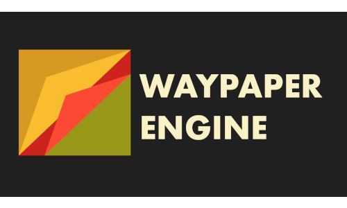

<div align="center">
  


### _A wallpaper setter gui, developed with ricing in mind!_ 🍚

**[<kbd> <br> Why <br>  </kbd>](#why)**
**[<kbd> <br> How to install <br> </kbd>](#install)**
**[<kbd> <br> Usage <br> </kbd>](#usage)**
**[<kbd> <br> TODO <br> </kbd>](#todo)**
**[<kbd> <br> Gallery <br> </kbd>](#gallery)**
**[<kbd> <br> Special Thanks <br> </kbd>](#special-thanks)**

</div>

# Features

-   Multi monitor support.
-   Four different types of playlists (Time of day, daily,interval based or static).
-   Easy configuration of all [swww](https://github.com/Horus645/swww) options.
-   Tray controls.
-   CLI Support.
-   All of [swww](https://github.com/Horus645/swww) features such as wallpaper change animations and wallpaper persistance through reboots.
-   Filter images by format, resolution,name,etc.
-   Run scripts on image set.
    <br>
    <br>

---


https://github.com/0bCdian/Waypaper-Engine/assets/101421807/4d49225a-cbdc-42a0-af67-aac823c47f98


---

# Why

I started this project for two main reasons, one as a learning oportunity, and two because the available options for a tool like this didn't suit my needs fully. I really like [swww](https://github.com/Horus645/swww) but it lacks a lot of the features that I missed from wallpaper engine in windows, so this is my attempt to bridge that gap a little.

# Install

Simply install from the aur like so:

```bash
yay -S waypaper-engine
```
or 

```bash
yay -S waypaper-engine-git
```

Both the normal and -git version conflict with each other, so make sure to delete the other with `yay -Rns package_name package_name-debug` before installing either.

## Manual installation
Be advised you will need to run some of the commands with sudo privileges as you will be copying files to protected paths.

1) Clone this repo `git clone git@github.com:0bCdian/Waypaper-Engine.git` or download and extract the zip file
2) cd into Waypaper-Engine
3) run `npm run build`
4) cd into release `cd release`
5) Optional: if you want to change the tray icon, change the 512x512.png image inside linux-unpacked/resources/icons
6) Optional: copy the 512x512.png file to the icons system directory `cp linux-unpacked/resources/icons/512x512.png /usr/share/icons/hicolor/512x512/apps/waypaper-engine.png`
7) copy the whole directory to it's final destination `sudo cp ./linux-unpacked -rt /opt/waypaper-engine`
8) go back to root dir `cd ..`
9) cd into cli `cd cli`
10) copy waypaper-engine file to your $PATH or /usr/bin `sudo cp ./waypaper-engine /usr/bin` or `cp ./waypaper/engine $HOME/.local/bin` be advised, if you do not copy the cli file to /usr/bin, the path you're copying it into must be in your $PATH, read [this](https://askubuntu.com/questions/551990/what-does-path-mean) for more info
11) go back to root `cd ..`
12) copy the .desktop file to /usr/share/applications `sudo cp ./waypaper-engine.desktop /usr/share/applications/`

and you're done!

# Usage

Simply start the app and add wallpapers to the gallery, from there you can double click to set the wallpapers or right click for more options, to create playlists simply click on the checkboxes that appear when hover over the images, and configure it, and then save it to auto start it.

# Examples

### Autostart on hyprland just the daemon

Add to your hyprland.conf the following lines:

```bash
exec-once=waypaper-engine daemon
```

### Add scripts to run on each image set

> [!WARNING]
> Make sure the script in question has execution permissions
Put you bash scripts in this path:
```bash
$HOME/.waypaper_engine/scripts
```

The scripts are always passsed as an argument the path of the image being set, so you can do stuff like this:


https://github.com/0bCdian/Waypaper-Engine/assets/101421807/f454a904-7fa7-4ce9-86e9-f8fbc86e8c2b

# TODO

-   [ ] Add testing.
-   [ ] Have a ci/cd pipeline.
-   [x] Implement a logger for errors.
-   [x] Publish in the aur.
-   [x] Find a good icon/logo for the app (Thank you [Cristian Avendaño](https://github.com/c-avendano)!).
-   [ ] Add flatpak support.
-   [x] Add scripts feature.
-   [x] Add playlists per monitor.

_If you encounter any problems or would like to make a suggestion, please feel free to open an issue_.

# Gallery


# Special Thanks

**[LGFae](https://github.com/LGFae)** - _for the amazing little tool that swww is !_ ❤️

**[Simon Ser](https://git.sr.ht/~emersion/)** - _for wlr-randr, without it making this work across different wayland wm's would've been a nightmare_ 🥲

**[Cristian Avendaño](https://github.com/c-avendano)** - _for creating the amazing logo!_ 💪
