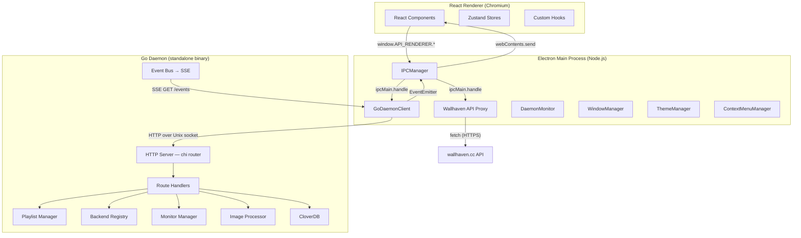
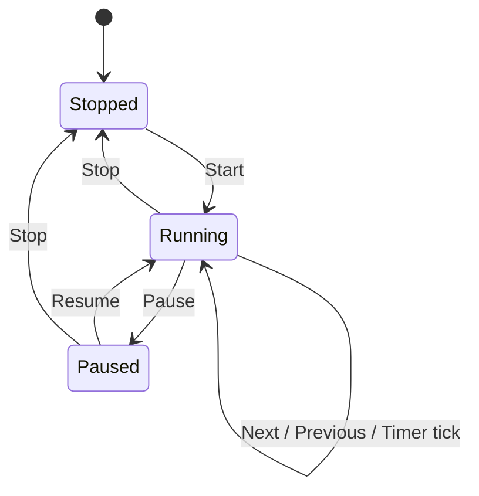
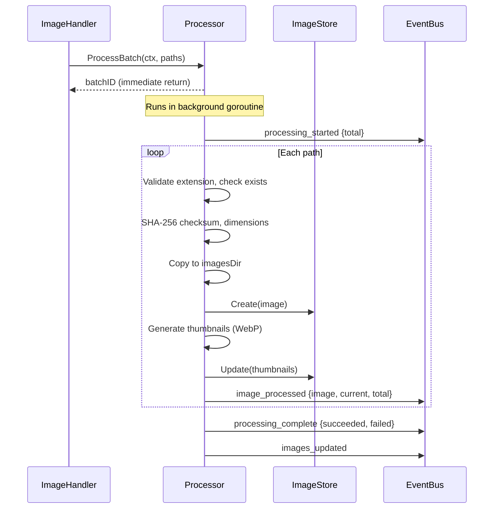
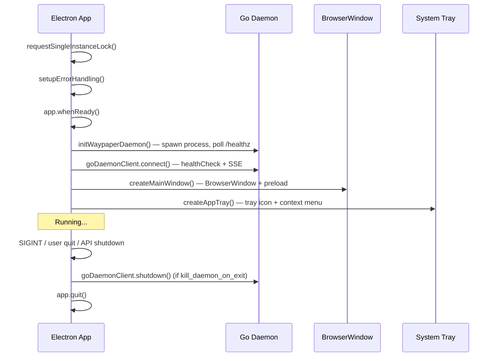
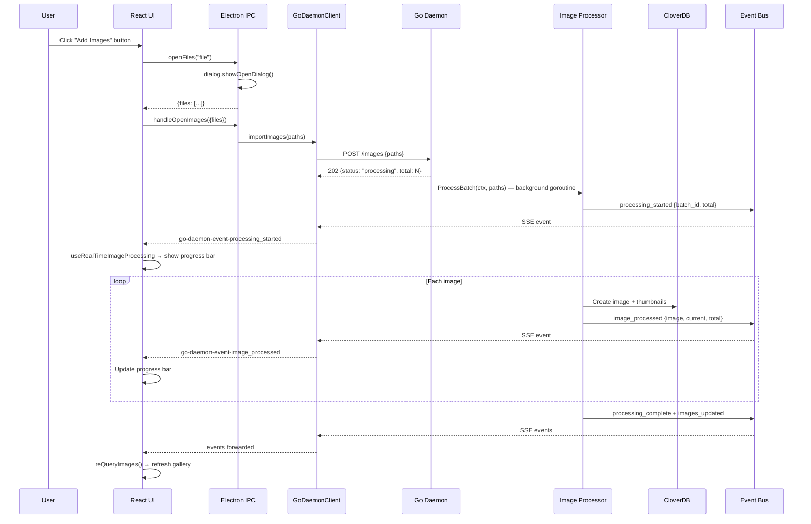
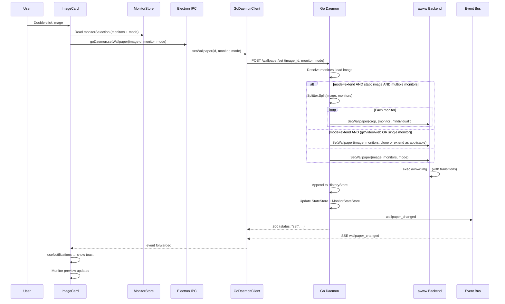
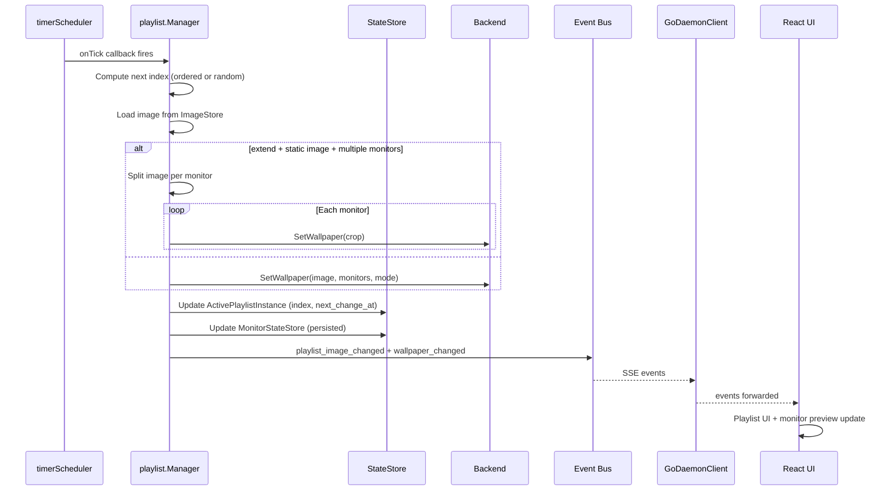
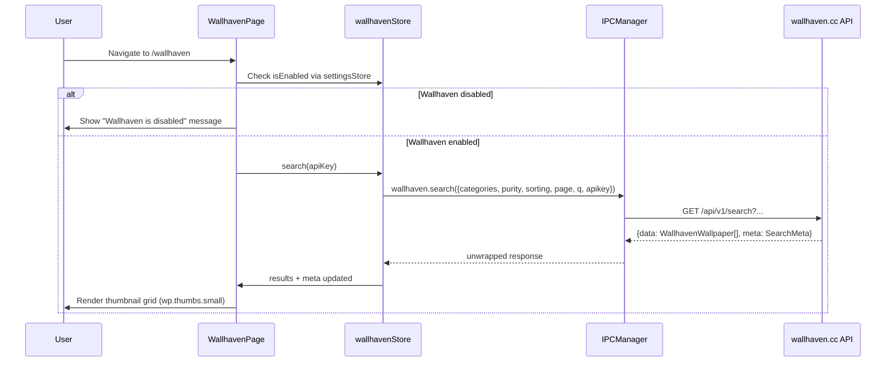
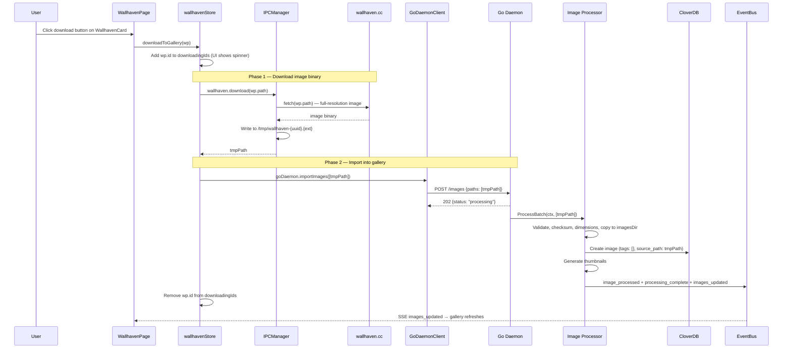

# Waypaper Engine — Architecture, Bug Audit & Developer Guide

> **Version**: 3.0.0  
> **Last updated**: 2026-04-06  
> **Audience**: developers who need to understand, debug, extend, or fix Waypaper Engine

---

## Table of Contents

- [1. System Overview](#1-system-overview)
  - [1.1 Three-Layer Architecture](#11-three-layer-architecture)
  - [1.2 Transport & Contracts](#12-transport--contracts)
  - [1.3 Key Design Decisions](#13-key-design-decisions)
  - [1.4 Security (daemon socket & HTML wallpapers)](#14-security-daemon-socket--html-wallpapers)
- [2. Go Daemon (`daemon/`)](#2-go-daemon-daemon)
  - [2.1 Entry Point & Startup](#21-entry-point--startup)
  - [2.2 HTTP Server & Routing](#22-http-server--routing)
  - [2.3 Request Handlers](#23-request-handlers)
  - [2.4 Playlist Engine](#24-playlist-engine)
  - [2.5 Image Processing Pipeline](#25-image-processing-pipeline)
  - [2.6 Backend Abstraction](#26-backend-abstraction)
  - [2.7 Monitor Detection](#27-monitor-detection)
  - [2.8 Persistence (CloverDB)](#28-persistence-cloverdb)
  - [2.9 Event Bus & SSE](#29-event-bus--sse)
  - [2.10 Configuration (Viper + TOML)](#210-configuration-viper--toml)
  - [2.11 CLI](#211-cli)
- [3. Electron Main Process (`electron/`)](#3-electron-main-process-electron)
  - [3.1 Application Lifecycle](#31-application-lifecycle)
  - [3.2 GoDaemonClient — HTTP + SSE Bridge](#32-godaemonclient--http--sse-bridge)
  - [3.3 IPCManager — IPC Router](#33-ipcmanager--ipc-router)
  - [3.4 Preload Script — contextBridge API](#34-preload-script--contextbridge-api)
  - [3.5 Supporting Managers](#35-supporting-managers)
  - [3.6 Daemon Process Management](#36-daemon-process-management)
- [4. React Renderer (`src/`)](#4-react-renderer-src)
  - [4.1 Component Tree & Routing](#41-component-tree--routing)
  - [4.2 State Management (Zustand)](#42-state-management-zustand)
  - [4.3 Custom Hooks](#43-custom-hooks)
  - [4.4 Real-Time Event Handling](#44-real-time-event-handling)
- [5. Data Flow Walkthroughs](#5-data-flow-walkthroughs)
  - [5.1 User Imports Images](#51-user-imports-images)
  - [5.2 User Sets a Wallpaper](#52-user-sets-a-wallpaper)
  - [5.3 Playlist Timer Tick](#53-playlist-timer-tick)
  - [5.4 User Downloads Wallhaven Wallpaper to Gallery](#54-user-downloads-wallhaven-wallpaper-to-gallery)
- [6. Type Contract Alignment](#6-type-contract-alignment)
- [7. Bug Audit](#7-bug-audit)
- [8. Developer Guide](#8-developer-guide)
  - [8.1 Prerequisites](#81-prerequisites)
  - [8.2 Quick Start](#82-quick-start)
  - [8.3 Project Layout](#83-project-layout)
  - [8.4 Build & Package](#84-build--package)
  - [8.5 Running the Daemon Standalone](#85-running-the-daemon-standalone)
  - [8.6 Debugging](#86-debugging)
  - [8.7 Extension Points](#87-extension-points)

---

## 1. System Overview

### 1.1 Three-Layer Architecture

Waypaper Engine is composed of three processes that communicate over well-defined boundaries:



| Layer | Language | Process | Role |
|-------|----------|---------|------|
| **Go Daemon** | Go | `waypaper-daemon` | Wallpaper management, playlists, image processing, monitor detection, backend orchestration. Exposes HTTP REST + SSE over a Unix socket. |
| **Electron Main** | TypeScript/Node.js | Electron main process | Bridges renderer to daemon. Manages windows, tray, menus, themes, and daemon lifecycle. |
| **React Renderer** | TypeScript/React | Chromium renderer | User interface. Gallery, playlist editor, settings, monitor selection. |

### 1.2 Transport & Contracts

| Boundary | Transport | Contract Source |
|----------|-----------|-----------------|
| Daemon ↔ Electron | HTTP REST + SSE over Unix domain socket (`$XDG_RUNTIME_DIR/waypaper-engine.sock`) | [`daemon/API_CONTRACT.md`](../daemon/API_CONTRACT.md) |
| Electron Main ↔ Renderer | Electron IPC via `contextBridge` | [`electron/preload.ts`](../electron/preload.ts) + [`src/types/electron.d.ts`](../src/types/electron.d.ts) |
| TypeScript type mirror of Go API | — | [`electron/daemon-go-types.ts`](../electron/daemon-go-types.ts) mirrors Go structs in [`daemon/internal/store/models.go`](../daemon/internal/store/models.go) |

There is **no gRPC** in this project — all daemon communication is HTTP+SSE.

### 1.3 Key Design Decisions

- **Daemon is independent**: it can run without Electron (started via CLI or systemd), enabling headless operation and third-party integrations.
- **Electron is a thin bridge**: almost no business logic lives in the Electron main process. It translates IPC calls into HTTP requests and forwards SSE events.
- **CloverDB for persistence**: lightweight embedded document database, no external DB server needed.
- **Pluggable backends**: `awww`, `hyprpaper`, `feh`, and `wayland-utauri` implement a common `Backend` interface. Adding a new backend requires implementing ~6 methods.
- **SSE for real-time**: all state changes (wallpaper applied, image imported, playlist advanced) flow as SSE events to connected clients.

### 1.4 Security (daemon socket & HTML wallpapers)

The Go daemon is a **local** service: control plane is **HTTP over a Unix domain socket** only (see §1.2). There is no intentional remote network API on the daemon itself.

**Operational hygiene**: socket permissions and path validation on IPC matter (who can connect, what paths are accepted for wallpaper loads). Treat the socket like any other local privileged channel.

**wayland-utauri + HTML wallpapers**: the meaningful script-driven risk is **local HTML wallpapers** running in a WebKit webview: script can use `fetch`/XHR (e.g. after reading local content) to **talk to the network** if the engine allows it. That is **not** the same threat model as generic untrusted web content, but it is the one vector worth tightening.

Mitigation (user-controlled in config; manifest flags are authoritative except for outbound network):

- **Default**: when navigating to a user HTML wallpaper (`file:` document), wayland-utauri sets WebKit’s **default** CSP to `connect-src 'none'`, blocking network `fetch`/XHR/WebSocket targets unless both the global toggle and the per-manifest policy allow it.
- **Opt-in network**: set **`backend.wayland-utauri.allow_network_wallpapers = true`** when you want `waypaper.json` `capabilities.network` to participate. Effective `connect-src` is `global allow ∧ manifest network`. The daemon calls **`POST /settings/network`** on sync.
- **Other capabilities** (keyboard, audio reactive, pointer, parallax) follow **`waypaper.json`** / gallery values; wallpaper JS cannot change them—only the gallery, manifest on disk, and the daemon control socket (local user) can.

Images, video, and GIF wallpapers are not treated as an HTML/script exfil channel in this model. Asset-protocol scope breadth is a **Tauri/`convertFileSrc` mechanics** concern (paths the user can already read), not a separate “attacker in `$HOME`” story.

**Optional follow-ups (not security requirements):** Tauri’s asset allowlist is static in the `waypaper-tauri` repository (`src-tauri/tauri.conf.json`). We do **not** currently expand scope at runtime; if static globs still miss edge-case paths on a given Tauri version, investigate that version’s APIs for runtime scope updates, or a **Rust read → `blob:` URL** path in the wallpaper renderer to bypass asset scope for images only.

---

## 2. Go Daemon (`daemon/`)

### 2.1 Entry Point & Startup

**File**: [`daemon/cmd/daemon/main.go`](../daemon/cmd/daemon/main.go)

The `startDaemon(configPath, logLevel)` function is the composition root. It executes this sequence:

```
1.  Acquire PID lock ($XDG_RUNTIME_DIR/waypaper-engine.pid)
2.  Load config (Viper + TOML)
3.  Setup logging (slog → stderr + rotating file via lumberjack)
4.  Ensure directories exist (images, thumbnails, db, socket parent)
5.  Open CloverDB → construct all stores
6.  Create event bus, wire config-file-change callback
7.  Detect compositor (Wayland/X11) → create MonitorManager with providers
8.  Register backends (awww, feh, hyprpaper, wayland-utauri), register defaults in Viper
9.  Activate configured backend; fallback to any available if preferred fails
10. Initialize active backend (may start/check awww-daemon/hyprpaper/wayland-utauri)
11. Create image Processor + Splitter
12. Restore wallpapers from persisted MonitorState
13. Create Playlist Manager
14. Build all HTTP handlers → router → HTTP server on Unix socket
15. Start serving; block on SIGINT/SIGTERM or API shutdown request
16. Graceful shutdown: stop playlists → HTTP server → backend → event bus → DB → lock
```

### 2.2 HTTP Server & Routing

**Files**: [`daemon/internal/server/`](../daemon/internal/server/)

- `server.go` — wraps `http.Server`, binds to the Unix socket (removes stale socket, sets `0700` permissions).
- `routes.go` — uses `go-chi/chi` to wire all routes. The `Handlers` struct aggregates all handler instances.
- `middleware.go` — `RequestID` (UUIDv4), `Logger` (slog), `Recoverer` (panic → 500 JSON).
- `sse.go` — `SSEBroker` subscribes to the event bus and streams `event:` + `data:` frames with 30s keepalive heartbeats.

**Route map** (all under the Unix socket):

| Method | Path | Handler | Description |
|--------|------|---------|-------------|
| GET | `/healthz` | HealthHandler | Liveness probe |
| GET | `/info` | HealthHandler | Version, PID, uptime |
| POST | `/shutdown` | HealthHandler | Graceful stop |
| GET | `/images` | ImageHandler | Paginated gallery |
| POST | `/images` | ImageHandler | Import images (async) |
| DELETE | `/images` | ImageHandler | Batch delete |
| GET | `/images/{id}` | ImageHandler | Single image |
| PATCH | `/images/{id}` | ImageHandler | Update name/tags/selected |
| POST | `/images/select-all` | ImageHandler | Batch select/deselect |
| GET | `/images/{id}/thumbnail` | ImageHandler | Thumbnail path |
| GET | `/images/{id}/thumbnail/raw` | ImageHandler | Serve thumbnail binary |
| GET | `/images/{id}/raw` | ImageHandler | Serve original image |
| GET | `/images/count` | ImageHandler | Total count |
| GET | `/images/history` | WallpaperHandler | Change history |
| POST | `/wallpaper/set` | WallpaperHandler | Set wallpaper |
| POST | `/wallpaper/random` | WallpaperHandler | Random wallpaper |
| POST | `/wallpaper/history/next` | WallpaperHandler | 501 — not yet implemented |
| POST | `/wallpaper/history/previous` | WallpaperHandler | 501 — not yet implemented |
| GET | `/playlists` | PlaylistHandler | List all |
| POST | `/playlists` | PlaylistHandler | Create |
| GET | `/playlists/{id}` | PlaylistHandler | Get one |
| PATCH | `/playlists/{id}` | PlaylistHandler | Update |
| DELETE | `/playlists/{id}` | PlaylistHandler | Delete |
| POST | `/playlists/{id}/start` | PlaylistHandler | Start playlist |
| POST | `/playlists/{id}/stop` | PlaylistHandler | Stop |
| POST | `/playlists/{id}/pause` | PlaylistHandler | Pause |
| POST | `/playlists/{id}/resume` | PlaylistHandler | Resume |
| POST | `/playlists/{id}/next` | PlaylistHandler | Advance |
| POST | `/playlists/{id}/previous` | PlaylistHandler | Rewind |
| GET | `/playlists/active` | PlaylistHandler | All active (grouped) |
| GET | `/playlists/active/{monitor}` | PlaylistHandler | Active for monitor |
| POST | `/playlists/active/stop` | PlaylistHandler | Stop all |
| POST | `/playlists/active/pause` | PlaylistHandler | Pause all |
| POST | `/playlists/active/resume` | PlaylistHandler | Resume all |
| POST | `/playlists/active/next` | PlaylistHandler | Advance all |
| POST | `/playlists/active/previous` | PlaylistHandler | Rewind all |
| GET | `/monitors` | MonitorHandler | List monitors |
| GET | `/monitors/{name}` | MonitorHandler | Get monitor |
| GET | `/config` | ConfigHandler | Full config |
| PATCH | `/config` | ConfigHandler | Multi-section update |
| GET | `/config/{section}` | ConfigHandler | Section config |
| PATCH | `/config/{section}` | ConfigHandler | Section update |
| GET | `/backends` | BackendHandler | List backends |
| POST | `/backends/{name}/activate` | BackendHandler | Switch backend |
| GET | `/events` | SSEBroker | SSE event stream |

### 2.3 Request Handlers

**Directory**: [`daemon/internal/handler/`](../daemon/internal/handler/)

Each handler file follows the same pattern:

1. Parse request (URL params, query params, JSON body) using shared helpers (`ParseBody`, `ParseIntParam`, `ParsePagination`).
2. Call store/service methods.
3. Publish relevant SSE events via the event bus.
4. Return JSON via `WriteJSON` or errors via `WriteError`.

Key handlers and their dependencies:

| Handler | File | Dependencies |
|---------|------|-------------|
| `ImageHandler` | `images.go` | `ImageStore`, `image.Processor`, `events.Bus` |
| `WallpaperHandler` | `wallpaper.go` | `ImageStore`, `HistoryStore`, `StateStore`, `MonitorStateStore`, `backend.Registry`, `MonitorManager`, `image.Splitter`, `events.Bus` |
| `PlaylistHandler` | `playlists.go` | `PlaylistStore`, `StateStore`, `playlist.Manager`, `events.Bus` |
| `MonitorHandler` | `monitors.go` | `MonitorManager` |
| `ConfigHandler` | `config_handler.go` | `config.ConfigManager`, `backend.Registry`, `events.Bus` |
| `BackendHandler` | `backends.go` | `backend.Registry`, `config.ConfigManager`, `events.Bus` |
| `HealthHandler` | `health.go` | version info, shutdown callback |

### 2.4 Playlist Engine

**Directory**: [`daemon/internal/playlist/`](../daemon/internal/playlist/)

The playlist engine has two main parts:

**Manager** (`manager.go`): orchestrates playlist lifecycle.



- `Start(ctx, playlistID, target)` — loads playlist, resolves monitors, stops conflicting playlists, creates a `Scheduler`, applies the first image, publishes `PlaylistStarted`.
- `Stop/Pause/Resume` — update scheduler and in-memory state, publish events.
- `Next/Previous` — advance index, apply image, publish `PlaylistImageChanged`.
- Playlist runs use `context.WithCancel(context.Background())` — they are detached from the HTTP request and live until explicitly stopped or daemon shutdown.

**Schedulers** (`scheduler.go`): pluggable timing strategies.

| Scheduler | Playlist Type | Behavior |
|-----------|--------------|----------|
| `timerScheduler` | `timer` | Fires every N seconds, supports ordered/random order |
| `timeOfDayScheduler` | `time_of_day` | Fires at configured minutes-since-midnight slots |
| `dayOfWeekScheduler` | `day_of_week` | Fires at midnight for each day's image |
| `manualScheduler` | `manual` | No-op; only advances via explicit Next/Previous |

For `time_of_day` and `day_of_week` playlists, a `missedEventChecker` goroutine polls every 10 seconds to detect and recover from missed transitions (e.g., if the system was asleep).

### 2.5 Image Processing Pipeline

**Directory**: [`daemon/internal/image/`](../daemon/internal/image/)

**Processor** (`processor.go`): handles image imports.



**Splitter** (`splitter.go`): for extend mode when the backend lacks native extend support. Slices a single image into per-monitor crops based on monitor geometry, with a disk cache (`imagesDir/processed/{imageID}/cache.json`) keyed on source path, size, mtime, and monitor layout.

**Thumbnailer** (`thumbnailer.go`): generates multi-resolution WebP thumbnails (`default`, `720p`, `1080p`, `1440p`, `4k`) under the thumbnails directory.

### 2.6 Backend Abstraction

**Directory**: [`daemon/internal/backend/`](../daemon/internal/backend/)

The `Backend` interface in `backend.go`:

```go
type Backend interface {
    Name() string
    IsAvailable() bool
    Capabilities() Capabilities
    Initialize(ctx context.Context) error
    Shutdown(ctx context.Context) error
    SetWallpaper(ctx context.Context, req WallpaperRequest) error
    RegisterDefaults(v *viper.Viper)
    ValidateConfig(raw json.RawMessage) error
    ParseConfig(raw json.RawMessage) (any, error)
}
```

`Capabilities` declares what a backend supports (compositors, media kinds, transitions, per-monitor targeting, daemon process). **Extend** spanning for static raster images is always handled in the engine: the daemon splits the image and calls `SetWallpaper` once per monitor with `Mode=individual`. GIF, video, and web wallpapers use **clone** semantics when the user chose extend (same path on all monitors); history and persisted monitor state still record the user’s **extend** intent.

**Implemented backends**:

| Backend | Directory | Compositor | Transitions | Per-Monitor | Daemon Process |
|---------|-----------|-----------|-------------|-------------|----------------|
| `awww` | `backend/awww/` | Wayland | Yes | Yes | Yes (`awww-daemon`) |
| `hyprpaper` | `backend/hyprpaper/` | Wayland (Hyprland) | No | Yes | Yes (`hyprpaper`) |
| `feh` | `backend/feh/` | X11 | No | No | No |
| `wayland-utauri` | `backend/waylandutauri/` | Wayland | Yes | Yes | Yes (external control API daemon) |

The **wayland-utauri** adapter sends `transition` / `duration_ms` on `POST /wallpaper/load` (`wait_for_completion=false`), embeds **`parallax`** on the load body when enabled, and only calls **`POST /wallpaper/parallax`** after load when parallax is disabled (to reset runtime state). With **`parallax_enabled`** it can also run an optional **Hyprland/Sway workspace → `parallax-move`** loop (`parallax_compositor_driver`); see [PARALLAX_WL_DRIVER.md](PARALLAX_WL_DRIVER.md). Config: `backend.wayland-utauri` (legacy `backend.waylandutauri` still read). See [WAYLAND_UTAURI_FIRST_PARTY_INTEGRATION_SPEC.md](WAYLAND_UTAURI_FIRST_PARTY_INTEGRATION_SPEC.md) §4.2.1.

The `Registry` (`registry.go`) manages backend registration, activation, and lookup. It is thread-safe via `sync.RWMutex`.

### 2.7 Monitor Detection

**Directory**: [`daemon/internal/monitor/`](../daemon/internal/monitor/)

`MonitorManager` auto-detects the compositor (Wayland vs X11) and selects the best available provider:

| Provider | Tool | Compositor | Priority |
|----------|------|-----------|----------|
| wayland-utauri | `GET /wallpaper/status` (Unix socket) | Wayland | 30 |
| `wlrRandrProvider` | `wlr-randr` | Wayland (wlroots) | 10 |
| `xrandrProvider` | `xrandr --query` | X11 | 10 |

Monitor data includes name, resolution (width/height), position (x/y), scale, refresh rate, and transform. This geometry is used by the image splitter for extend mode.

### 2.8 Persistence (CloverDB)

**Directory**: [`daemon/internal/store/`](../daemon/internal/store/)

CloverDB is an embedded document database (NoSQL). Collections:

| Collection | Model | Purpose |
|------------|-------|---------|
| `images` | `Image` | Gallery of imported wallpapers |
| `playlists` | `Playlist` | User-created playlists with configuration and image lists |
| `history` | `ImageHistoryEntry` | Global wallpaper change log |
| `monitor_state` | `MonitorState` | Per-monitor current wallpaper (persisted for restore on restart) |

Runtime state (active playlists, current wallpapers) is kept **in-memory only** in `StateStore` and reconstructed on startup.

**CloverDB gotcha**: CloverDB normalizes struct field names using Go names (e.g., `ImageID`) but reads back via `json.Unmarshal` which expects JSON tag names (`image_id`). The codebase works around this by wrapping structs with `jsonValue()` before storing. See the comment at the top of [`daemon/internal/store/models.go`](../daemon/internal/store/models.go).

### 2.9 Event Bus & SSE

**File**: [`daemon/internal/events/bus.go`](../daemon/internal/events/bus.go)

An in-process pub/sub bus. `Publish()` is non-blocking — if a subscriber's buffered channel (size 64) is full, the event is dropped with a warning log. This prevents slow SSE clients from backpressuring the daemon.

Event types (all defined as constants in `events/types.go`):

| Category | Events |
|----------|--------|
| Image processing | `processing_started`, `image_processed`, `image_error`, `processing_complete` |
| Gallery | `images_updated`, `playlists_updated` |
| Wallpaper | `wallpaper_changed` |
| Playlist | `playlist_started`, `playlist_stopped`, `playlist_paused`, `playlist_resumed`, `playlist_image_changed` |
| Monitor | `monitor_connected`, `monitor_disconnected` |
| Config | `config_changed` |

The SSE broker (`server/sse.go`) subscribes to the bus and streams events to HTTP clients on `GET /events`. It supports filtering by `?types=` query parameter and sends keepalive comments every 30 seconds.

### 2.10 Configuration (Viper + TOML)

**Directory**: [`daemon/internal/config/`](../daemon/internal/config/)

Configuration is stored in a TOML file at `$XDG_CONFIG_HOME/waypaper-engine/config.toml`. The `ViperManager` handles:

- Setting defaults for all sections (app, daemon, backend, monitors, wallhaven).
- Reading the config file (or creating it with defaults if missing).
- Watching for external file changes via `fsnotify` and publishing `config_changed` events.
- Thread-safe reads/writes via `sync.RWMutex`.

**Config sections**:

| Section | TOML key | Go struct | Description |
|---------|----------|-----------|-------------|
| `app` | `[app]` | `AppConfig` | UI preferences (theme, start page, monitor modal) |
| `daemon` | `[daemon]` | `DaemonConfig` | Log level, kill-on-exit behavior |
| `backend` | `[backend]` | `BackendSection` | Active backend type + per-backend sub-sections |
| `monitors` | `[monitors]` | `MonitorsConfig` | Selected monitors and image set type |
| `wallhaven` | `[wallhaven]` | `WallhavenConfig` | Wallhaven integration (`api_key: string`, `enabled: bool`) |

Backend-specific config lives under `[backend.<name>]` in the TOML file. Each backend registers its own defaults via `RegisterDefaults(v)` and validates/parses its config section independently.

### 2.11 CLI

**Files**: [`daemon/cmd/daemon/cli*.go`](../daemon/cmd/daemon/)

The daemon binary doubles as a CLI client using Cobra. CLI commands communicate with the running daemon over the same Unix socket HTTP API:

```
waypaper-daemon start              # Start the daemon
waypaper-daemon stop               # POST /shutdown
waypaper-daemon status             # GET /info
waypaper-daemon set <image-id>     # POST /wallpaper/set
waypaper-daemon random             # POST /wallpaper/random
waypaper-daemon images list        # GET /images
waypaper-daemon playlist active    # GET /playlists/active
waypaper-daemon monitors           # GET /monitors
waypaper-daemon config             # GET /config
waypaper-daemon backends           # GET /backends
```

---

## 3. Electron Main Process (`electron/`)

### 3.1 Application Lifecycle

**File**: [`electron/main.ts`](../electron/main.ts)



The main window uses secure webPreferences: `contextIsolation: true`, `nodeIntegration: false`, `sandbox: false`. The preload script bridges the gap.

### 3.2 GoDaemonClient — HTTP + SSE Bridge

**File**: [`electron/goDaemonClient.ts`](../electron/goDaemonClient.ts)

This class extends `EventEmitter` and is the sole point of contact between the Electron process and the Go daemon.

**HTTP requests**: a private `request<T>(method, path, body?)` method sends JSON over the Unix socket with a 30-second timeout.

**SSE connection**: `connectSSE()` opens a persistent `GET /events` connection, parses `event:` + `data:` lines from the stream, and emits them as typed `EventEmitter` events. On disconnect, it schedules reconnection with exponential backoff (1s, 2s, ... up to 30s, max 50 attempts).

**Public API surface** (all return Promises):

```
ping(), getInfo(), shutdown()
getImages(), getImage(), getImageCount(), importImages(), deleteImages(), ...
setWallpaper(), setRandomWallpaper()
getPlaylists(), getPlaylist(), createPlaylist(), startPlaylist(), stopPlaylist(), ...
getMonitors(), getMonitor()
getConfig(), updateConfig(), getConfigSection(), updateConfigSection()
getBackendConfig(), updateBackendConfig()
getBackends(), activateBackend()
```

### 3.3 IPCManager — IPC Router

**File**: [`electron/managers/IPCManager.ts`](../electron/managers/IPCManager.ts)

The central IPC hub. All `ipcMain.handle` registrations go through this class.

**Response wrapping**: most channels return `{ success: true, data: result }` on success or `{ success: false, error: message }` on failure. The exception is `"go-daemon-command"` which returns raw values / throws (the "unwrapped" channel).

**`go-daemon-command` router**: a large switch statement that maps action strings to `GoDaemonClient` method calls:

```
"get_images"  → goDaemonClient.getImages(params)
"set_wallpaper" → goDaemonClient.setWallpaper(id, monitor, mode)
"start_playlist" → goDaemonClient.startPlaylist(id, monitor, mode)
... (40+ actions)
```

**SSE event forwarding**: subscribes to all daemon events on `GoDaemonClient` and broadcasts them to all renderer windows as `go-daemon-event-{eventName}`.

**Other IPC channels**: `openFiles` (file/folder dialog), `handleOpenImages` (forward to daemon import), `openContextMenu`, window management, theme management, daemon control.

**Wallhaven API proxy**: the IPCManager also registers three channels that bypass the Go daemon entirely and proxy requests directly to the external Wallhaven API (`wallhaven.cc`) using Node.js `fetch()`. This is the only IPC pathway that reaches outside the local system.

| Channel | Proxied endpoint | Behavior |
|---------|-----------------|----------|
| `wallhaven-search` | `GET https://wallhaven.cc/api/v1/search` | Forwards query params (categories, purity, sorting, page, q, apikey). Returns `{ data: WallhavenWallpaper[], meta: SearchMeta }`. |
| `wallhaven-wallpaper` | `GET https://wallhaven.cc/api/v1/w/{id}` | Fetches full wallpaper detail including tags. Accepts optional `apikey` for NSFW content. |
| `wallhaven-download` | Direct image URL (`https://w.wallhaven.cc/full/...`) | Downloads the full-resolution image binary, writes it to a temp file (`/tmp/wallhaven-{uuid}.{ext}`), and returns the temp path. |

These channels are subject to the standard `{ success, data }` response wrapping. The preload script unwraps the envelope before exposing the result to the renderer — see Section 3.4.

### 3.4 Preload Script — contextBridge API

**File**: [`electron/preload.ts`](../electron/preload.ts)

Exposes `window.API_RENDERER` to the renderer via `contextBridge.exposeInMainWorld`. This is the **only** way the renderer can communicate with the main process.

The API is organized into sections:

| Section | Key methods |
|---------|------------|
| `goDaemon.*` | All daemon operations + `on(event, callback)` for SSE events |
| `wallhaven.*` | `search(params)` — proxied Wallhaven search, `getWallpaper(id, apikey?)` — full wallpaper detail with tags, `download(imageUrl)` — download full-res image to temp file. All three unwrap the `{ success, data }` IPC envelope and throw on failure. |
| Theme | `getNativeTheme()`, `setThemeSource()`, `onNativeThemeUpdated()` |
| Window | `minimizeWindow()`, `maximizeWindow()`, `closeWindow()`, etc. |
| App control | `exitApp()`, `getDaemonStatus()`, `restartDaemon()` |
| File ops | `openFiles()`, `handleOpenImages()`, `openContextMenu()` |
| Events | `onAppError()`, `onDaemonStatusUpdate()`, `onMenuEvent()` |

The `goDaemon.on()` method correctly implements a disposer pattern — it returns a cleanup function that removes the exact wrapper listener. Other `on*`/`off*` pairs do not (see [BUG-1](#bug-1-offdaemonstatusupdate--offmenuevent-listener-leak)).

**Types**: [`src/types/electron.d.ts`](../src/types/electron.d.ts) declares the global `window.API_RENDERER` type, importing from [`electron/daemon-go-types.ts`](../electron/daemon-go-types.ts).

### 3.5 Supporting Managers

| Manager | File | Responsibility |
|---------|------|---------------|
| `WindowManager` | `electron/managers/WindowManager.ts` | Window creation, bounds persistence, config caching |
| `ThemeManager` | `electron/managers/ThemeManager.ts` | Native theme tracking, broadcasting theme changes |
| `DaemonMonitor` | `electron/managers/DaemonMonitor.ts` | Periodic health checks (every 5s), status broadcasting |
| `ContextMenuManager` | `electron/managers/ContextMenuManager.ts` | Image/gallery context menus, sends menu events to renderer |
| `PlaylistController` | `electron/playlistController.ts` | Tray-level playlist controls (next/prev/pause/stop) |

### 3.6 Daemon Process Management

**File**: [`globals/startDaemons.ts`](../globals/startDaemons.ts)

`initWaypaperDaemon()`:
1. Checks if the Unix socket already exists and is responsive (reuses existing daemon).
2. If not, spawns `waypaper-daemon start` as a detached child process.
3. Polls for socket existence + `GET /healthz` success (up to 20 attempts, 500ms apart).
4. On failure, calls `process.exit(1)` (see [BUG-4](#bug-4-initwaypaperdaemon-fatally-exits-despite-continue-without-daemon-intent)).

**Config reading**: [`globals/configReader.ts`](../globals/configReader.ts) reads the same TOML config file that the daemon uses, providing socket path, directories, and other settings to the Electron process. It watches for file changes and reloads.

---

## 4. React Renderer (`src/`)

### 4.1 Component Tree & Routing

**Router**: `HashRouter` (in [`src/App.tsx`](../src/App.tsx))

| Route | Component | Description |
|-------|-----------|-------------|
| `/` | `Home` → `Gallery` | Main gallery view with image grid, filters, pagination |
| `/configuration` | `Configuration` | Placeholder; sidebar switches to contextual config |
| `/settings` | `Settings` → `SettingsTabs` | App, daemon, and backend settings |
| `/wallhaven` | `WallhavenPage` (lazy-loaded) | Search, browse, and download wallpapers from wallhaven.cc. Includes search toolbar, filter controls (category/purity/sorting), paginated thumbnail grid, and detail modal with download-to-gallery action. Only accessible when `config.wallhaven.enabled` is `true`. |

**Layout**: `ModernAppLayout` provides a full-height DaisyUI drawer with:
- **Navbar** at top (with sidebar toggle)
- **Sidebar** with navigation links + "Quit" button
- **Content area** with the routed page
- **Global overlays**: `ImageProcessingProgress`, `ToastContainer`, `Modals`

**Key components**:

| Component | File | Purpose |
|-----------|------|---------|
| `Gallery` | `Gallery.tsx` | Entry point for gallery; shows `AddImagesCard` if empty, else `Filters` + `PaginatedGallery` |
| `PaginatedGallery` | `PaginatedGallery.tsx` | Scrollable image grid + pagination + `PlaylistTrack` dock |
| `ImageCard` | `ImageCard.tsx` | Single image tile: selection, playlist checkbox, double-click to set wallpaper, context menu |
| `PlaylistTrack` | `PlaylistTrack.tsx` | Bottom dock: drag-and-drop playlist strip (using `@dnd-kit`), save/load/configure/clear buttons |
| `SavePlaylistModal` | `SavePlaylistModal.tsx` | Name + save/update playlist to daemon, optionally start it |
| `LoadPlaylistModal` | `LoadPlaylistModal.tsx` | Pick + load existing playlist from daemon |
| `AddToPlaylistModal` | `AddToPlaylistModal.tsx` | Add selected images to an existing playlist |
| `PlaylistConfigurationModal` | `PlaylistConfigurationModal.tsx` | Configure playlist type, interval, order |
| `monitorsModal` + `Monitor` | `monitorsModal.tsx`, `Monitor.tsx` | Monitor selection + live wallpaper preview |
| `SettingsTabs` | `settings/SettingsTabs.tsx` | Tabbed settings: App, Daemon, Backend, Wallhaven sections |
| `DaemonStatusComponent` | `settings/DaemonStatusComponent.tsx` | Daemon status + start/stop/restart controls |
| `WallhavenSettingsSection` | `settings/sections/WallhavenSettingsSection.tsx` | Enable/disable toggle + API key input with "Test" button that validates against `wallhaven.cc/api/v1/settings` |
| `WallhavenPage` | `routes/Wallhaven.tsx` | Full Wallhaven search UI: `WallhavenCard` thumbnails, `WallhavenDetailModal` for preview/download |

### 4.2 State Management (Zustand)

All application state lives in Zustand stores. There is no Redux, no React Context for data (only for theming).

| Store | File | Key State | Key Actions |
|-------|------|-----------|-------------|
| `useImagesStore` | `stores/images.tsx` | `imagesArray`, `imagesMap`, `filters`, `selectedImages`, `pagination`, `currentPage` | `reQueryImages()`, `fetchPage()`, `fetchMissingImages()`, `deleteSelectedImages()`, `addToSelectedImages()`, `selectAllImagesInGallery()` |
| `usePlaylistStore` | `stores/playlist.tsx` | `playlist` (current editing), `playlistImagesSet`, `lastAddedImageID` | `addImagesToPlaylist()`, `removeImagesFromPlaylist()`, `clearPlaylist()`, `setPlaylist()`, `movePlaylistArrayOrder()`, `swapImageTimes()` |
| `useMonitorStore` | `stores/monitors.tsx` | `monitorSelection` (selected + mode), `monitorsList` | `setMonitorSelection()` (persists to daemon), `reQueryMonitors()`, `setLastSavedMonitorConfig()` |
| `useSettingsStore` | `stores/settingsStore.ts` | `config` (UnifiedConfig), `errors`, `searchTerm`, `filteredSections` | `loadConfig()`, `saveConfigSection()`, `resetToDefaults()`, `handleConfigChange()` |
| `useAwwwConfigStore` | `stores/awwwConfig.tsx` | `awwwConfig` | `saveConfig()` (persists to daemon), `getConfig()` |
| `useToastStore` | `stores/toastStore.tsx` | `toasts[]` | `addToast()`, `removeToast()` |
| `useImageProcessingStore` | `stores/imageProcessingStore.ts` | `batches` map | `startBatch()`, `updateBatch()`, `completeBatch()` |
| `useDesignSystemStore` | `stores/designSystemStore.ts` | neobrutalist config, design tokens | `syncToDOM()` |
| `useWallhavenStore` | `stores/wallhavenStore.ts` | `filters` (query, categories, purity, sorting, page), `results` (`WallhavenWallpaper[]`), `meta` (pagination), `selectedWallpaper`, `downloadingIds` | `search(apiKey?)`, `downloadToGallery(wp)`, `selectWallpaper(wp)`, `setQuery()`, `toggleCategory()`, `togglePurity()`, `setSorting()`, `setPage()` |
| `openImagesStore` | `hooks/useOpenImages.tsx` | `isActive` | `openImages({action})` — file/folder dialogs + daemon import |

**Theme**: managed via React Context (`contexts/ThemeContext.tsx`), not Zustand. Persists to `localStorage` and applies via `data-theme` attribute on `<html>`.

### 4.3 Custom Hooks

| Hook | File | Purpose |
|------|------|---------|
| `useLoadAppConfig` | `hooks/useLoadAppConfig.ts` | One-time config load on app start |
| `useLoadMonitors` | `hooks/useLoadMonitors.ts` | One-time monitor query + restore saved selection |
| `useLoadImages` | `hooks/useLoadImages.ts` | One-time initial image query |
| `useImagePagination` | `hooks/useImagePagination.tsx` | Page derivation, `handlePageChange()`, keyboard shortcuts (`Ctrl+A`) |
| `useFilteredImages` | `hooks/useFilteredImages.ts` | Client-side resolution/format filtering, `Ctrl+Shift+A` shortcut |
| `useRealTimeImageProcessing` | `hooks/useRealTimeImageProcessing.ts` | Subscribes to processing SSE events, updates `imageProcessingStore`, re-queries images on completion |
| `useNotifications` | `hooks/useNotifications.ts` | Subscribes to wallpaper/playlist events, shows toasts |
| `useContextMenuEvents` | `hooks/useContextMenuEvents.ts` | Bridges Electron menu events to store actions (add to playlist, delete, select, etc.) |
| `useSetLastActivePlaylist` | `hooks/useSetLastActivePlaylist.ts` | On mount, loads active playlist for current monitor into playlist store |
| `useWindowBounds` | `hooks/useWindowBounds.ts` | Periodically reads/saves window bounds |
| `useOpenImages` | `hooks/useOpenImages.tsx` | Zustand store + dialog orchestration for image import |

### 4.4 Real-Time Event Handling

The renderer subscribes to daemon events via `window.API_RENDERER.goDaemon.on(event, callback)`. The flow:

```
Go daemon publishes event to EventBus
  → SSE broker streams to /events
    → GoDaemonClient parses SSE, emits EventEmitter event
      → IPCManager forwards as "go-daemon-event-{type}" to all windows
        → preload.ts wrapper calls registered callbacks
          → React hooks/stores process the event
```

Key subscriptions:

| Event | Subscriber | Action |
|-------|-----------|--------|
| `processing_started` | `useRealTimeImageProcessing` | Start batch in `imageProcessingStore` |
| `image_processed` | `useRealTimeImageProcessing` | Update batch progress |
| `processing_complete` | `useRealTimeImageProcessing` | Complete batch, re-query images |
| `images_updated` | `useRealTimeImageProcessing` | Re-query images |
| `wallpaper_changed` | `useNotifications`, `Monitor` component | Show toast, update preview |
| `playlists_updated` | `PlaylistTrack`, `Modals` | Refresh playlist list |
| `playlist_started/stopped` | `useNotifications` | Show toast |
| `config_changed` | `settingsStore` (module-level) | Reload config if source is "file" |

---

## 5. Data Flow Walkthroughs

### 5.1 User Imports Images



### 5.2 User Sets a Wallpaper



### 5.3 Playlist Timer Tick



### 5.4 User Downloads Wallhaven Wallpaper to Gallery

The Wallhaven integration allows users to search, browse, and download wallpapers from [wallhaven.cc](https://wallhaven.cc) directly into the local gallery. It is the only feature that reaches an external network service, and the only IPC pathway that bypasses the Go daemon for its core operations (search, detail, download). The daemon is only involved at the final import step.

**Files involved**:

| Layer | Files |
|-------|-------|
| Frontend page | [`src/routes/Wallhaven.tsx`](../src/routes/Wallhaven.tsx) — `WallhavenPage`, `WallhavenCard`, `WallhavenDetailModal` |
| Frontend store | [`src/stores/wallhavenStore.ts`](../src/stores/wallhavenStore.ts) — `useWallhavenStore` |
| Frontend settings | [`src/components/settings/sections/WallhavenSettingsSection.tsx`](../src/components/settings/sections/WallhavenSettingsSection.tsx) |
| IPC proxy | [`electron/managers/IPCManager.ts`](../electron/managers/IPCManager.ts) — `setupWallhavenHandlers()` |
| Preload | [`electron/preload.ts`](../electron/preload.ts) — `wallhaven.*` namespace |
| Config (Go) | [`daemon/internal/config/types.go`](../daemon/internal/config/types.go) — `WallhavenConfig` |
| Config (TS) | [`electron/daemon-go-types.ts`](../electron/daemon-go-types.ts) — `WallhavenConfig`, [`shared/types/unifiedConfig.ts`](../shared/types/unifiedConfig.ts) |

**Data model** — the Wallhaven API returns wallpapers with this shape (mirrored in `WallhavenWallpaper`):

| Field | Type | Description |
|-------|------|-------------|
| `id` | `string` | Wallhaven wallpaper ID (e.g., `"abc123"`) |
| `url` | `string` | Wallhaven page URL |
| `path` | `string` | Full-resolution image URL (e.g., `https://w.wallhaven.cc/full/ab/wallhaven-abc123.jpg`) |
| `thumbs` | `{ large, original, small }` | Thumbnail URLs at various sizes |
| `resolution` | `string` | e.g., `"1920x1080"` |
| `category` | `string` | `"general"`, `"anime"`, or `"people"` |
| `purity` | `string` | `"sfw"`, `"sketchy"`, or `"nsfw"` |
| `colors` | `string[]` | Dominant hex colors |
| `file_size` | `number` | Size in bytes |
| `file_type` | `string` | MIME type (e.g., `"image/jpeg"`) |
| `tags` | `Array<{ id, name, purity }>` | **Only populated by the detail endpoint** (`/api/v1/w/{id}`), not by search results |
| `views`, `favorites` | `number` | Popularity metrics |
| `source` | `string` | Original source URL |

**Search & browse flow**:



**Download-to-gallery flow**:



**Search filter controls** — `WallhavenPage` exposes toolbar controls that map to Wallhaven API query parameters:

| Control | Store field | API param | Values |
|---------|------------|-----------|--------|
| Search input | `filters.query` | `q` | Free text |
| Category buttons | `filters.categories` | `categories` | 3-char bitmask (`"111"` = all) for general/anime/people |
| Purity buttons | `filters.purity` | `purity` | 3-char bitmask (`"100"` = SFW only) for sfw/sketchy/nsfw |
| Sort dropdown | `filters.sorting` | `sorting` | `date_added`, `relevance`, `random`, `views`, `favorites`, `toplist` |
| Pagination | `filters.page` | `page` | Page number (24 results per page) |

NSFW purity requires an API key. The NSFW button is only rendered when `apiKey` is present.

**Metadata preservation gap** — the current download flow discards all Wallhaven metadata:

| Wallhaven metadata | Available in API | Preserved on import | Notes |
|--------------------|-----------------|--------------------|----|
| Image pixels | Yes (`dimension_x`, `dimension_y`) | Re-extracted | The daemon processor extracts dimensions from the raw image file independently |
| File size | Yes (`file_size`) | Re-computed | Computed from the copied file in `imagesDir` |
| Format | Yes (`file_type`) | Re-detected | Detected from file extension |
| **Tags** | **Detail endpoint only** | **No** | `processOne()` hardcodes `Tags: []string{}`. The search endpoint does not return tags; a separate `GET /api/v1/w/{id}` call is needed. |
| Colors | Yes (`colors[]`) | No | No corresponding field on the `Image` model |
| Category / Purity | Yes | No | No corresponding field on the `Image` model |
| Source URL | Yes (`source`, `url`) | No | `SourcePath` is set to the temp file path, not the Wallhaven URL |
| Wallhaven ID | Yes (`id`) | No | Not stored anywhere |
| Views / Favorites | Yes | No | No corresponding field on the `Image` model |

The `Image` model in the Go daemon does have a `Tags []string` field and a `SourcePath string` field (see Section 2.8). Tags are updatable via `PATCH /images/{id}` and searchable/filterable. The gap is purely in the import pipeline: `POST /images` only accepts `{ paths: [...] }` with no metadata sidecar, and `downloadToGallery()` only passes `wp.path` (the image URL) — no Wallhaven metadata travels with the file.

---

## 6. Type Contract Alignment

The Go daemon structs and the TypeScript types are manually kept in sync. Here is the mapping:

| Go Struct (store/models.go) | TypeScript Interface (daemon-go-types.ts) | Notes |
|---|---|---|
| `store.Image` | `Image` | 1:1 match. `Thumbnails` is `map[string]string` / `ImageThumbnails` (typed keys in TS). |
| `store.ImageHistoryEntry` | `ImageHistoryEntry` | 1:1 match. `Mode` is `string` in Go / `MonitorMode` in TS. |
| `store.HistorySource` | `ImageHistorySource` | 1:1 match. Pointer fields (`*int`) map to `number \| undefined` in TS. |
| `store.Playlist` | `Playlist` | 1:1 match. |
| `store.PlaylistConfiguration` | `PlaylistConfiguration` | `Interval` and `Order` are always present in Go (zero value) but optional in TS. Functionally fine. |
| `store.PlaylistImage` | `PlaylistImage` | `Time *int` in Go → `time?: number` in TS. Match. |
| `store.ActivePlaylistInstance` | `ActivePlaylistInstance` | Go has `Mode string`; TS has `mode: MonitorMode`. Go has `*int`/`*time.Time` for nullable fields; TS uses `number \| null` / `string \| null`. Match. |
| `store.ActivePlaylistResponse` | `ActivePlaylistResponse` | 1:1 match. |
| `store.ActiveMonitorInfo` | `ActiveMonitorInfo` | 1:1 match. |
| `monitor.Monitor` | `Monitor` | 1:1 match. |
| `config types` | `AppConfig`, `DaemonConfig`, `BackendSection`, `MonitorsConfig`, `UnifiedConfig` | Match. `AppConfig` in TS has `show_monitor_modal_on_start` which the Go config also supports. |
| `config.WallhavenConfig` | `WallhavenConfig` | 1:1 match. Go: `APIKey string` + `Enabled bool`. TS: `api_key: string` + `enabled: boolean`. Included in `UnifiedConfig` on both sides. |
| `backend.Capabilities` | `BackendCapabilities` | 1:1 match. |
| `awww.Config` | `AwwwConfig` | Field names match the TOML/JSON keys (`transition_type`, `resize`, etc.). TS uses `string` for enum-like fields. |

**Renderer-side extensions**: [`src/types/rendererTypes.ts`](../src/types/rendererTypes.ts) defines `rendererImage` (extends `Image` with `time: number | null` for playlist context) and `rendererPlaylist` (local editing model with optional `id`).

---

## 7. Bug Audit

### BUG-1: `offDaemonStatusUpdate` / `offMenuEvent` listener leak

| | |
|---|---|
| **Severity** | Medium |
| **Location** | [`electron/preload.ts`](../electron/preload.ts) ~lines 300-330 |
| **Problem** | `onDaemonStatusUpdate` wraps the callback: `(_, data) => callback(data)`. But `offDaemonStatusUpdate` calls `ipcRenderer.removeListener(channel, callback)` with the *original* callback reference. Since the wrapper has a different identity, the listener is never removed. Same pattern affects `onMenuEvent`/`offMenuEvent`. |
| **Impact** | Listeners accumulate over the app's lifetime. Each component mount/unmount cycle adds a listener without removing the previous one. Eventually causes memory growth and duplicate event processing. |
| **Fix** | Use the disposer pattern already proven by `goDaemon.on()`: return a cleanup function that captures the wrapper reference. |

### BUG-2: `SelectAll` capped at 200 images

| | |
|---|---|
| **Severity** | Medium |
| **Location** | [`daemon/internal/handler/images.go`](../daemon/internal/handler/images.go) — `SelectAll` handler |
| **Problem** | `GetAll(ctx, ImageQueryOpts{Page: 1, PerPage: 200})` fetches only the first 200 images. Galleries with >200 images have the rest silently unaffected by select-all. |
| **Impact** | Users with large galleries cannot reliably select/deselect all images. |
| **Fix** | Add a dedicated `store.UpdateAll(ctx, field, value)` method that operates directly on the collection without pagination, or loop through pages until exhausted. |

### BUG-3: SSE reconnection silently gives up

| | |
|---|---|
| **Severity** | Low-Medium |
| **Location** | [`electron/goDaemonClient.ts`](../electron/goDaemonClient.ts) — `scheduleSseReconnect` |
| **Problem** | After 50 failed attempts, emits `maxReconnectAttemptsReached` but nothing listens. The app continues running with no real-time updates — wallpaper changes, playlist progress, and import progress all go silent. |
| **Impact** | After extended daemon unavailability (e.g., daemon restart taking >25 minutes), the UI becomes stale with no user-visible indication. |
| **Fix** | Either listen for `maxReconnectAttemptsReached` in IPCManager and broadcast a warning to the renderer, or switch to infinite reconnection with increasing backoff (cap at 60s). |

### BUG-4: `initWaypaperDaemon` fatally exits

| | |
|---|---|
| **Severity** | Medium |
| **Location** | [`globals/startDaemons.ts`](../globals/startDaemons.ts) ~line 95 vs [`electron/main.ts`](../electron/main.ts) ~line 148 |
| **Problem** | `initWaypaperDaemon()` calls `process.exit(1)` on failure. `main.ts` wraps the call in try/catch with "Continuing without daemon functionality", but `process.exit()` bypasses the catch. |
| **Impact** | The app cannot gracefully degrade when the daemon fails to start — it always hard-exits. |
| **Fix** | Replace `process.exit(1)` with `throw new Error(...)` so the caller can decide whether to exit or continue in degraded mode. |

### BUG-5: Config `GetSection` returns 200 for unknown sections

| | |
|---|---|
| **Severity** | Low |
| **Location** | [`daemon/internal/handler/config_handler.go`](../daemon/internal/handler/config_handler.go) + [`daemon/internal/config/viper_manager.go`](../daemon/internal/config/viper_manager.go) |
| **Problem** | The API contract says unknown sections return 404, but `ViperManager.GetSection` returns an empty map (never errors). So `GET /config/nonexistent` returns `200 {}`. |
| **Impact** | Clients cannot distinguish "empty section" from "section does not exist". Low practical impact since only known section names are used by the frontend. |
| **Fix** | Add an allowlist check in the handler: `if section not in {"app", "daemon", "backend", "monitors"} → 404`. |

### BUG-6: History navigation not implemented (501)

| | |
|---|---|
| **Severity** | Low (known limitation) |
| **Location** | [`daemon/internal/handler/wallpaper.go`](../daemon/internal/handler/wallpaper.go) — `HistoryNext` / `HistoryPrevious` |
| **Problem** | `POST /wallpaper/history/next` and `POST /wallpaper/history/previous` return 501. The CLI subcommands `next` and `previous` also hit these. |
| **Impact** | No history navigation from UI or CLI. Documented in API_CONTRACT.md. |
| **Fix** | Implement a cursor-based history walker in `StateStore` that tracks current position per monitor. |

### BUG-7: Duplicate global error handlers

| | |
|---|---|
| **Severity** | Low |
| **Location** | [`globals/setup.ts`](../globals/setup.ts), [`electron/main.ts`](../electron/main.ts) `setupErrorHandling()`, [`electron/managers/IPCManager.ts`](../electron/managers/IPCManager.ts) `setupErrorHandling()` |
| **Problem** | Three places attach `process.on("uncaughtException")` and `process.on("unhandledRejection")`. Each error triggers 3 log entries. |
| **Impact** | Noisy logs, potential `MaxListenersExceededWarning` over time. |
| **Fix** | Centralize in IPCManager (which also broadcasts to the renderer) and remove the other two. |

### BUG-8: Insecure `WindowManager` defaults

| | |
|---|---|
| **Severity** | Low |
| **Location** | [`electron/managers/WindowManager.ts`](../electron/managers/WindowManager.ts) `defaultConfig` |
| **Problem** | Default `webPreferences` use `nodeIntegration: true` and `contextIsolation: false`. The main window explicitly overrides to secure values, but any future window using defaults would be insecure. |
| **Impact** | No current impact (only one window). Risk increases if additional windows are added. |
| **Fix** | Flip the defaults: `nodeIntegration: false`, `contextIsolation: true`. |


### BUG-9: `settingsStore` module-level listener stacks on HMR

| | |
|---|---|
| **Severity** | Low (dev-only) |
| **Location** | [`src/stores/settingsStore.ts`](../src/stores/settingsStore.ts) — bottom of file |
| **Problem** | The `goDaemon.on("config_changed", ...)` call at module scope runs on every HMR reload. The disposer is captured in `_disposeConfigChanged` but never called, so listeners stack. |
| **Impact** | During development, config change events trigger `handleConfigChange()` multiple times (once per HMR cycle). No production impact since modules load exactly once. |
| **Fix** | Store the disposer in a module-level variable and call it before resubscribing, or guard with an `import.meta.hot` cleanup handler. |

---

## 8. Developer Guide

### 8.1 Prerequisites

| Requirement | Version | Purpose |
|-------------|---------|---------|
| **Go** | 1.26+ | Build the daemon binary |
| **Node.js** | 22+ | Build Electron + React frontend |
| **npm** | 10+ | Package management |
| **One wallpaper backend** | — | `awww` (Wayland), `hyprpaper` (Hyprland), or `feh` (X11) |
| **A compositor** | — | Any Wayland compositor (Hyprland, Sway, etc.) or X11 |
| **Git** | — | Version control |

Optional:
- `wlr-randr` or `xrandr` — for monitor detection if the compositor-specific tool isn't available.
- `make` — for convenience build targets.

### 8.2 Quick Start

```bash
# Clone the repo
git clone https://github.com/0bCdian/Waypaper-Engine.git
cd Waypaper-Engine

# Install Node dependencies
npm install

# Build daemon + start Vite dev server + Electron in dev mode
npm run dev
```

`npm run dev` does two things:
1. `npm run build:daemon` — runs `go build` in `daemon/`, producing `daemon/build/waypaper-daemon`.
2. `DEV=true vite` — starts Vite with HMR, then launches Electron pointing at `http://localhost:5173`.

The Electron main process will spawn the daemon binary automatically.

### 8.3 Project Layout

```
waypaper-engine/
├── daemon/                        # Go daemon — standalone binary
│   ├── cmd/daemon/                # CLI entry point (main.go, cli*.go)
│   ├── internal/
│   │   ├── backend/               # Backend interface + implementations
│   │   │   ├── awww/              #   awww backend
│   │   │   ├── hyprpaper/         #   hyprpaper backend
│   │   │   ├── feh/               #   feh backend
│   │   │   └── waylandutauri/      #   wayland-utauri backend adapter
│   │   ├── config/                # Viper-based TOML config manager
│   │   ├── events/                # In-process event bus (pub/sub)
│   │   ├── handler/               # HTTP request handlers
│   │   ├── image/                 # Image processor, splitter, thumbnailer
│   │   ├── monitor/               # Monitor detection (providers + manager)
│   │   ├── playlist/              # Playlist manager + schedulers
│   │   ├── server/                # HTTP server, router, middleware, SSE
│   │   ├── store/                 # Data models + CloverDB store implementations
│   │   └── system/                # Path utilities, PID lockfile
│   ├── go.mod / go.sum
│   └── API_CONTRACT.md            # REST API specification
│
├── electron/                      # Electron main process
│   ├── main.ts                    # App entry, window creation, lifecycle
│   ├── preload.ts                 # contextBridge API (window.API_RENDERER)
│   ├── goDaemonClient.ts          # HTTP + SSE client for Go daemon
│   ├── daemon-go-types.ts         # TypeScript mirrors of Go API types
│   ├── playlistController.ts      # Tray-level playlist controls
│   └── managers/
│       ├── IPCManager.ts          # Central IPC router
│       ├── WindowManager.ts       # Window creation + config
│       ├── DaemonMonitor.ts       # Health check polling
│       ├── ThemeManager.ts        # Theme tracking
│       └── ContextMenuManager.ts  # Right-click menus
│
├── src/                           # React renderer
│   ├── main.tsx                   # React entry point
│   ├── App.tsx                    # Root component, router, providers
│   ├── components/                # UI components
│   │   ├── Gallery.tsx            # Gallery entry
│   │   ├── PaginatedGallery.tsx   # Image grid + pagination
│   │   ├── ImageCard.tsx          # Single image tile
│   │   ├── PlaylistTrack.tsx      # Bottom playlist dock
│   │   ├── Filters.tsx            # Search + filter bar
│   │   ├── SavePlaylistModal.tsx
│   │   ├── LoadPlaylistModal.tsx
│   │   ├── monitorsModal.tsx
│   │   ├── Monitor.tsx
│   │   ├── layout/                # ModernAppLayout, NavBar, Sidebar
│   │   └── settings/              # Settings tabs + sections
│   ├── stores/                    # Zustand stores
│   │   ├── images.tsx
│   │   ├── playlist.tsx
│   │   ├── monitors.tsx
│   │   ├── settingsStore.ts
│   │   ├── awwwConfig.tsx
│   │   └── toastStore.tsx
│   ├── hooks/                     # Custom React hooks
│   ├── contexts/                  # ThemeContext
│   ├── types/                     # electron.d.ts, rendererTypes.ts, ipc.ts
│   ├── styles/                    # CSS (index.css, neobrutalist.css)
│   └── routes/                    # Home, Configuration, Settings
│
├── shared/                        # Code shared between electron + renderer
│   ├── constants.ts               # MENU_EVENTS, IPC_MAIN_EVENTS
│   └── types/                     # playlist, image, awww, unifiedConfig types
│
├── globals/                       # Electron-side global utilities
│   ├── setup.ts                   # Directory setup, logger, daemon path
│   ├── startDaemons.ts            # Daemon spawn + health polling
│   ├── configReader.ts            # TOML config reader (same file as daemon)
│   └── menus.ts                   # Dev menu, tray menu
│
├── package.json
├── vite.config.ts
├── tsconfig.json
├── Makefile                       # Top-level build orchestration
├── electron-builder.json          # Electron packaging config
├── waypaper-daemon.service        # systemd user service
└── waypaper-engine.desktop        # XDG desktop entry
```

### 8.4 Build & Package

| Command | What it does |
|---------|-------------|
| `make daemon` | Build Go daemon → `daemon/build/waypaper-daemon` |
| `npm run dev` | Build daemon + start Vite dev server + Electron |
| `npm run build` | Full production build (daemon + frontend + electron-builder) |
| `make electron` | Build daemon + frontend + package as Electron dir |
| `make appimage` | Build daemon + frontend + package as AppImage |
| `make install` | Install daemon binary + Electron app + systemd service + desktop entry |
| `make install-daemon` | Install just the daemon CLI to `/usr/local/bin` |
| `npm run test:daemon` | Run all Go tests with race detector |
| `npm run test:daemon:coverage` | Run tests + generate HTML coverage report |

### 8.5 Running the Daemon Standalone

The daemon is fully independent of Electron:

```bash
# Start the daemon (blocks until SIGINT/SIGTERM)
waypaper-daemon start

# In another terminal, use the CLI:
waypaper-daemon status
waypaper-daemon images list
waypaper-daemon set 42
waypaper-daemon random
waypaper-daemon playlist list
waypaper-daemon playlist start 1
waypaper-daemon monitors
waypaper-daemon config
waypaper-daemon backends

# Or use curl directly:
curl --unix-socket /run/user/$(id -u)/waypaper-engine.sock http://localhost/images
curl --unix-socket /run/user/$(id -u)/waypaper-engine.sock http://localhost/playlists/active

# Stream SSE events:
curl -N --unix-socket /run/user/$(id -u)/waypaper-engine.sock http://localhost/events
```

The daemon can also run as a systemd user service:

```bash
# Install the service file (done by `make install`)
systemctl --user enable waypaper-daemon
systemctl --user start waypaper-daemon
journalctl --user -u waypaper-daemon -f
```

### 8.6 Debugging

**Daemon logs**:
- File: `~/.local/share/waypaper-engine/daemon.log` (rotating, JSON format)
- Stderr: JSON-formatted log lines (visible in terminal when running standalone)
- Log level: configurable via `daemon.log_level` in config or `--log-level` CLI flag

**Electron DevTools**:
- In dev mode, DevTools open automatically.
- In production, press `Ctrl+Shift+I` to toggle.
- The renderer console shows all `console.log/warn/error` from React components and hooks.

**SSE event inspection**:
```bash
# Watch all events from the daemon in real time:
curl -N --unix-socket /run/user/$(id -u)/waypaper-engine.sock http://localhost/events

# Filter specific event types:
curl -N --unix-socket /run/user/$(id -u)/waypaper-engine.sock "http://localhost/events?types=wallpaper_changed,playlist_image_changed"
```

**IPC debugging**:
- In the Electron main process console (visible in terminal when running `npm run dev`), all IPC errors are logged with the channel name.
- `go-daemon-command` errors include the action name and full error.

**Database inspection**:
- CloverDB stores data at `~/.local/share/waypaper-engine/db/`.
- The daemon exposes all data via REST, so `curl` is usually sufficient.
- For direct DB access, CloverDB stores are Badger/BBolt files.

**Common issues**:

| Symptom | Likely cause | Fix |
|---------|-------------|-----|
| "Daemon failed to start" | Stale socket or PID lock | `rm /run/user/$(id -u)/waypaper-engine.sock /run/user/$(id -u)/waypaper-engine.pid` |
| Gallery empty after import | Processing still running | Check SSE events or `ImageProcessingProgress` component |
| Wallpaper not changing | Backend not initialized | Check `waypaper-daemon backends` — is the active backend available? |
| No real-time updates | SSE disconnected | Check Electron console for reconnection attempts |
| HMR not reloading data | Module-level flags (BUG-10) | Full page reload (`Ctrl+R`) |

### 8.7 Extension Points

#### Adding a New Backend

1. Create a new directory under `daemon/internal/backend/yourbackend/`.
2. Implement the `Backend` interface (see `backend/backend.go` for the 9 required methods).
3. Register it in `startDaemon()` in `main.go`:
   ```go
   yourBackend := yourbackend.New()
   backendRegistry.Register(yourBackend)
   yourBackend.RegisterDefaults(cfg.Viper())
   ```
4. The daemon, CLI, and frontend will automatically pick it up via the registry.

#### Adding a New Playlist Type

1. Add a new scheduler implementation in `daemon/internal/playlist/scheduler.go` satisfying the `Scheduler` interface (`Start`, `Stop`, `Pause`, `Resume`, `NextChangeAt`).
2. Update `Manager.Start()` in `manager.go` to construct your scheduler based on `Configuration.Type`.
3. Add the type string to `PlaylistType` in `daemon-go-types.ts` and `shared/types/playlist.ts`.
4. Update `PlaylistConfigurationModal` in the React UI to expose the new type's settings.

#### Adding a New SSE Event

1. Add the event type constant in `daemon/internal/events/types.go`.
2. Publish the event where needed: `bus.Publish(events.Event{Type: events.YourEvent, Data: ...})`.
3. Add the event name to the `EventType` union in `electron/daemon-go-types.ts`.
4. Add the event name to the forwarding list in `IPCManager.setupGoDaemonEventForwarding()`.
5. Subscribe in the renderer via `goDaemon.on("your_event", callback)`.

#### Adding a New Config Section

1. Define the Go struct in `daemon/internal/config/types.go`.
2. Add defaults in `ViperManager.NewViperManager()`.
3. Include the section in `Config` struct and `GetConfig()`/`GetSection()` handlers.
4. Mirror the type in `electron/daemon-go-types.ts` and `UnifiedConfig`.
5. Add a settings section component in `src/components/settings/sections/`.
6. Update `useSettingsStore` to handle the new section in `saveConfigSection()`.
