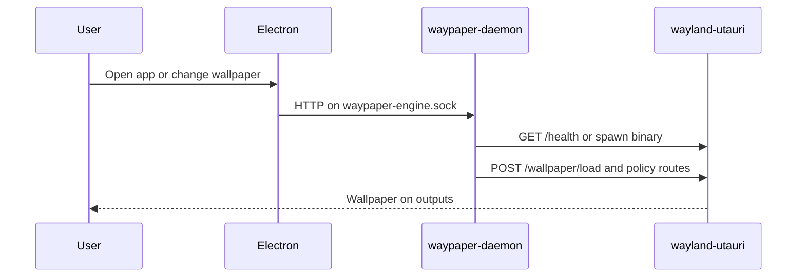

# Waypaper Engine — Critical User Journeys

**Purpose:** Step-by-step **happy paths** for the Waypaper Engine stack, plus **where to look** when something fails. Deep API and architecture detail: [ARCHITECTURE.md](./ARCHITECTURE.md), [daemon/API_CONTRACT.md](../daemon/API_CONTRACT.md).

**Convention:** Each journey lists **actors**, **preconditions**, **steps**, **expected outcome**, and **failure signals**.

---

## 1. First launch (GUI)

| | |
|--|--|
| **Actors** | End user; Electron app; `waypaper-daemon` |
| **Preconditions** | App installed ([README.md](../README.md) `make install` or equivalent); `waypaper-engine` launcher on `PATH`; at least one wallpaper backend available for the session (Wayland/X11). |
| **Steps** | 1. User runs `waypaper-engine` or `waypaper-engine run`. 2. Electron main starts or attaches to the Go daemon (bundled or `PATH`). 3. Renderer loads; preload bridges IPC to HTTP on the daemon Unix socket. 4. Client subscribes to SSE (`GET /events`) for live updates. |
| **Expected outcome** | Main window shows gallery or empty state; tray icon if enabled; no repeated error toasts. |
| **Failure signals** | Process exits immediately: check daemon log (`[daemon] log_file`), whether socket path is writable, PID lock conflicts. Blank UI with no updates: daemon may be down or SSE disconnected — `curl --unix-socket "$SOCKET" http://localhost/healthz` (use your configured `socket_path`). |

Reference: [ARCHITECTURE.md §3–4](./ARCHITECTURE.md), §5.1-style import flow.

---

## 2. Import and set a static wallpaper

| | |
|--|--|
| **Actors** | User; UI; daemon; image processor; active wallpaper backend |
| **Preconditions** | Daemon running; images directory and DB writable; backend initialized. |
| **Steps** | 1. User imports files or URLs (drag/drop, file picker, or paste). 2. Daemon enqueues processing (`POST /images`); SSE reports progress. 3. User sets wallpaper (per monitor, clone, or extend) from gallery or context menu. 4. Daemon resolves monitors and calls the active backend with absolute paths. |
| **Expected outcome** | Thumbnails appear; selected image(s) show on target monitor(s) according to mode. |
| **Failure signals** | Import stuck: SSE events and daemon logs around image processor. Wrong monitor: check monitor list API and `[monitors]` config. Wrong scaling: [IMAGE_DISPLAY_MODES.md](./IMAGE_DISPLAY_MODES.md) for backend-specific behavior. |

---

## 3. Playlist — timer-based advance

| | |
|--|--|
| **Actors** | User; playlist scheduler; daemon; backend |
| **Preconditions** | Playlist exists with interval (or time-of-day rules); images in playlist; playlist started for target monitors. |
| **Steps** | 1. User starts a playlist from the UI (or API). 2. Scheduler fires on interval; manager selects next image per rules. 3. Backend applies wallpaper; SSE notifies UI. |
| **Expected outcome** | Wallpaper rotates on schedule without manual intervention. |
| **Failure signals** | Timer stops: playlist paused/stopped state, daemon logs, single-instance issues. Wrong order: check playlist configuration and image list in API. |

Reference: [ARCHITECTURE.md §5.3](./ARCHITECTURE.md#53-playlist-timer-tick).

---

## 4. Headless / CLI usage

| | |
|--|--|
| **Actors** | Operator; `waypaper-daemon`; optional CLI (`waypaper-daemon` subcommands) or HTTP client |
| **Preconditions** | Daemon binary installed; config path known; socket not held by another user unless shared intentionally. |
| **Steps** | 1. Start daemon (`waypaper-daemon start` or systemd user service from install). 2. Confirm `GET /healthz`. 3. Use CLI (`set`, `random`, playlist commands, etc.) or raw HTTP over the Unix socket per [API_CONTRACT.md](../daemon/API_CONTRACT.md). |
| **Expected outcome** | Wallpaper and state change without Electron. |
| **Failure signals** | Connection refused: socket path, permissions, or daemon not running. Parse JSON error bodies and check daemon logs for handler failures. |

---

## 5. Wallhaven — search and download to gallery

| | |
|--|--|
| **Actors** | User; Electron (Wallhaven proxy); daemon |
| **Preconditions** | Wallhaven enabled and optional API key in config for NSFW tiers; network available in the GUI process. |
| **Steps** | 1. User opens Wallhaven view, adjusts filters, runs search. 2. User downloads chosen wallpaper into the gallery. 3. Daemon receives import paths and processes like local files. |
| **Expected outcome** | New image appears in gallery with thumbnails. |
| **Failure signals** | Download failures: Electron/network; import failures: daemon logs and `POST /images` behavior. Note: Wallhaven metadata preservation gaps are documented in [ARCHITECTURE.md §5.4](./ARCHITECTURE.md#54-user-downloads-wallhaven-wallpaper-to-gallery). |

---

## 6. First-party Wayland stack (Waypaper Engine + wayland-utauri)

Integrated journey: Engine drives the **wayland-utauri** host as the active backend.

| | |
|--|--|
| **Actors** | User; Electron; daemon; **wayland-utauri** process |
| **Preconditions** | Wayland session; `backend.type = "wayland-utauri"` in config; `wayland-utauri` on `PATH` **or** already running with matching API/service identity; `[backend.wayland-utauri]` timeouts and `expected_api_version` appropriate. |
| **Steps** | 1. User selects wayland-utauri in settings (or edits TOML) and restarts backend/daemon as needed. 2. On backend `Initialize`, daemon probes wayland-utauri health; starts child if needed (see [PRODUCTION_READINESS.md §8](./PRODUCTION_READINESS.md#8-with-wayland-utauri)). 3. Daemon runs **`SyncRuntimeFromConfig`**: pushes network allow, parallax, and image presentation over the control API before restoring wallpapers. 4. User sets image, GIF, video, or web wallpaper as usual; daemon translates to `POST /wallpaper/load` (async by default on the host). 5. For **web** wallpapers, capabilities come from the manifest / gallery; **effective** outbound network is `allow_network_wallpapers` from config **and** manifest `capabilities.network`. Further config changes re-sync via the same path. |
| **Expected outcome** | Visual parity with other backends for supported media; web wallpapers respect locked-down defaults until explicitly allowed. |
| **Failure signals** | **Contract / version mismatch:** health error — align `expected_service` / `expected_api_version` with the installed wayland-utauri ([daemon/internal/backend/waylandutauri/](../daemon/internal/backend/waylandutauri/)). **Binary missing:** `IsAvailable` false — install package or `PATH`. **Spawn exits:** daemon logs “wayland-utauri child process exited”; check Wayland display, lock file, or host logs. **Socket permission:** ensure `$XDG_RUNTIME_DIR` (or host fallback socket) is consistent with how you launch the session. |

**Host-side mirror of this journey:** In your checkout of the **wayland-utauri** repository, see `docs/CRITICAL_USER_JOURNEYS.md` §6.

---

## Related documents

| Document | Purpose |
|----------|---------|
| [PRODUCTION_READINESS.md](./PRODUCTION_READINESS.md) | Shipping, CI, security summary |
| [IMAGE_DISPLAY_MODES.md](./IMAGE_DISPLAY_MODES.md) | Per-backend display semantics |
| [ARCHITECTURE.md §5](./ARCHITECTURE.md#5-data-flow-walkthroughs) | Detailed data-flow walkthroughs |
