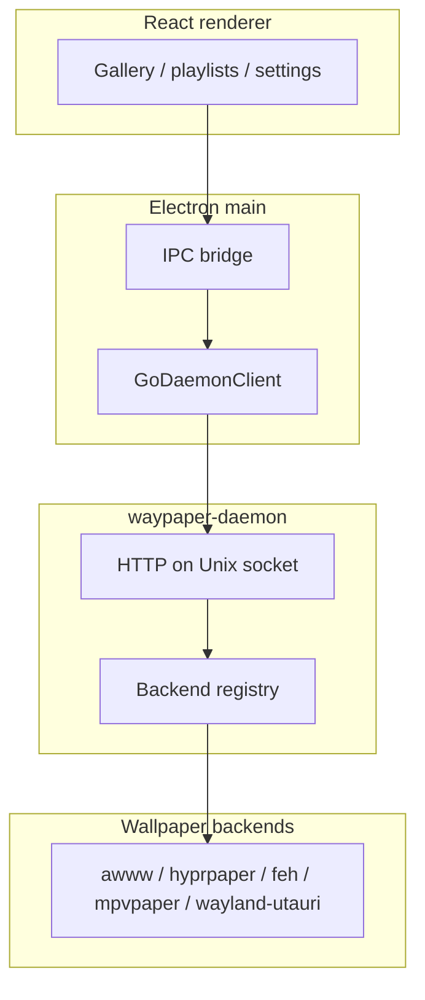

# Waypaper Engine — Production Readiness

**Audience:** distro packagers, operators, security reviewers, and contributors shipping or running Waypaper Engine.

**Canonical detail:** This note is a checklist and orientation layer. Architecture, API shapes, and deep flows live in [ARCHITECTURE.md](./ARCHITECTURE.md), [daemon/API_CONTRACT.md](../daemon/API_CONTRACT.md), and [packaging/README.md](../packaging/README.md).

---

## 1. Product status

Waypaper Engine is under **active development** (major rewrite: Go daemon, Electron UI, CloverDB). Expect **breaking changes** before stable release tags.

The Go daemon is a **local** service: control plane is **HTTP over a Unix domain socket**, not a network-facing API. There is no intentional remote administration port.

---

## 2. Architecture snapshot

Three cooperating processes: React (Chromium) ↔ Electron main ↔ `waypaper-daemon` (Go). The daemon talks to **pluggable wallpaper backends** (awww, hyprpaper, feh, mpvpaper, wayland-utauri).

Full diagram and file references: [ARCHITECTURE.md §1](./ARCHITECTURE.md#11-three-layer-architecture).

---

## 3. Release and quality gates

| Gate | What runs |
|------|-----------|
| **Local / PR CI** | `npm run ci:check` — see [package.json](../package.json): build daemon, Oxfmt check, Oxlint, `gofmt`, TypeScript `tsc --noEmit`, Vitest, `go test -short ./...`, production Vite build. |
| **GitHub Actions** | [.github/workflows/ci.yml](../.github/workflows/ci.yml) on `pull_request` and push to `main` / `refactor/wayaper-daemon`. |
| **Release** | [.github/workflows/release.yml](../.github/workflows/release.yml) on `v*` tags: tag must match `package.json` version and sit on an allowed branch; then same `ci:check`, then AppImage + `waypaper-daemon` binary + `checksums.txt`. |

**Explicit gap:** **Playwright e2e** (`npm run test:e2e`) is **not** part of `ci:check`. Treat e2e as manual or supplemental until wired into CI.

---

## 4. Operational model

| Concern | Notes |
|---------|--------|
| **Socket** | Configured in TOML `[daemon] socket_path` (sample [config.toml](../config.toml) uses `/tmp/waypaper-engine.sock`; many setups use `$XDG_RUNTIME_DIR/waypaper-engine.sock`). Socket mode is restrictive (`0700`); see server implementation in `daemon/internal/server/`. |
| **Single instance** | PID lock under `$XDG_RUNTIME_DIR/waypaper-engine.pid` (see [ARCHITECTURE.md §2.1](./ARCHITECTURE.md#21-entry-point--startup)). |
| **Logs** | `[daemon] log_file`, rotation (`log_max_size`, `log_max_age`, `log_max_backups`), `log_level`. |
| **Install layout** | [packaging/README.md](../packaging/README.md): `make install-system` places unpacked Electron under `/opt/waypaper-engine`, `waypaper-daemon` and launcher in `bin/`, systemd user unit. |
| **Liveness** | `GET /healthz` on the daemon socket ([daemon/API_CONTRACT.md](../daemon/API_CONTRACT.md)). |

---

## 5. Security and trust boundaries

- **Daemon socket:** Any local user who can connect can drive wallpaper and gallery APIs. Operate on single-user machines or lock down socket location and filesystem permissions like any privileged local IPC.
- **Electron ↔ renderer:** IPC return values are wrapped; preload unwraps errors. See [AGENTS.md](../AGENTS.md) (IPC envelope rules). Threat model assumes **trusted local UI** talking to the daemon.
- **HTML / web wallpapers (wayland-utauri backend):** Script in local web wallpapers is the main **exfil-style** concern if network is allowed. Defaults block `fetch`/XHR/WebSocket via WebKit CSP unless policy and manifest align. Host policy keys under `[backend.wayland-utauri]` clamp manifest capabilities. Summary: [ARCHITECTURE.md §1.4](./ARCHITECTURE.md#14-security-daemon-socket--html-wallpapers).

---

## 6. Dependencies and compatibility

| Requirement | Version / notes |
|-------------|-----------------|
| **Go** | 1.26+ (CI and [mise.toml](../mise.toml)) |
| **Node.js** | 22+ |
| **Compositor** | Wayland or X11; detection and monitor providers in daemon (see ARCHITECTURE §2.7) |
| **Backends** | At least one of: awww, hyprpaper, feh, mpvpaper, or wayland-utauri, matching your session type |

Behavior differences (clone / extend / per-monitor, fit modes): [IMAGE_DISPLAY_MODES.md](./IMAGE_DISPLAY_MODES.md).

---

## 7. Known limitations (curated)

These are called out for **operators**, not as a full bug list. Details and fixes live in [ARCHITECTURE.md §7](./ARCHITECTURE.md#7-bug-audit).

| Topic | Risk |
|-------|------|
| **SSE reconnection** | After many failed reconnects, real-time UI updates may stop without a prominent user warning ([BUG-3](./ARCHITECTURE.md#bug-3-sse-reconnection-silently-gives-up)). |
| **Daemon start failure** | `initWaypaperDaemon` can hard-exit the Electron process on failure ([BUG-4](./ARCHITECTURE.md#bug-4-initwaypaperdaemon-fatally-exits)). |
| **Wallpaper history API** | History next/previous may return 501 until implemented ([BUG-6](./ARCHITECTURE.md#bug-6-history-navigation-not-implemented-501)). |
| **Select-all cap** | Gallery select-all may not cover very large libraries in one shot ([BUG-2](./ARCHITECTURE.md#bug-2-selectall-capped-at-200-images)). |

---

## 8. With wayland-utauri

When `backend.type = "wayland-utauri"`:

- The **`wayland-utauri` binary must be on `PATH`** (or already running and reachable on its control socket).
- The daemon **connects to `GET /health`** on the wayland-utauri socket; if unreachable and the error is not a **contract mismatch**, it may **spawn** the binary with `Pdeathsig` so the child dies with the daemon (no argv for HTML network policy). After init, **`SyncRuntimeFromConfig`** posts **`/settings/network`**, parallax, image presentation, and related settings from TOML **before** wallpaper restore.
- **`expected_service`** and **`expected_api_version`** in config must match the running host (see [daemon/internal/backend/waylandutauri/](../daemon/internal/backend/waylandutauri/)).
- **Packaging:** First-party Wayland installs should declare **`wayland-utauri`** as a dependency ([packaging/README.md](../packaging/README.md)).

**Companion doc (host + integration):** In your checkout of the **wayland-utauri** repository, see `docs/PRODUCTION_READINESS.md`. **User journeys:** [CRITICAL_USER_JOURNEYS.md](./CRITICAL_USER_JOURNEYS.md) (includes integrated journey §6).

---

## Related documents

| Document | Purpose |
|----------|---------|
| [ARCHITECTURE.md](./ARCHITECTURE.md) | System design, security, data flows |
| [daemon/API_CONTRACT.md](../daemon/API_CONTRACT.md) | HTTP routes and payloads |
| [IMAGE_DISPLAY_MODES.md](./IMAGE_DISPLAY_MODES.md) | Backend-specific display behavior |
| [WAYLAND_UTAURI_FIRST_PARTY_INTEGRATION_SPEC.md](./WAYLAND_UTAURI_FIRST_PARTY_INTEGRATION_SPEC.md) | Historical integration notes (prefer live code + API contracts) |
| [CRITICAL_USER_JOURNEYS.md](./CRITICAL_USER_JOURNEYS.md) | Happy-path and integrated flows |
