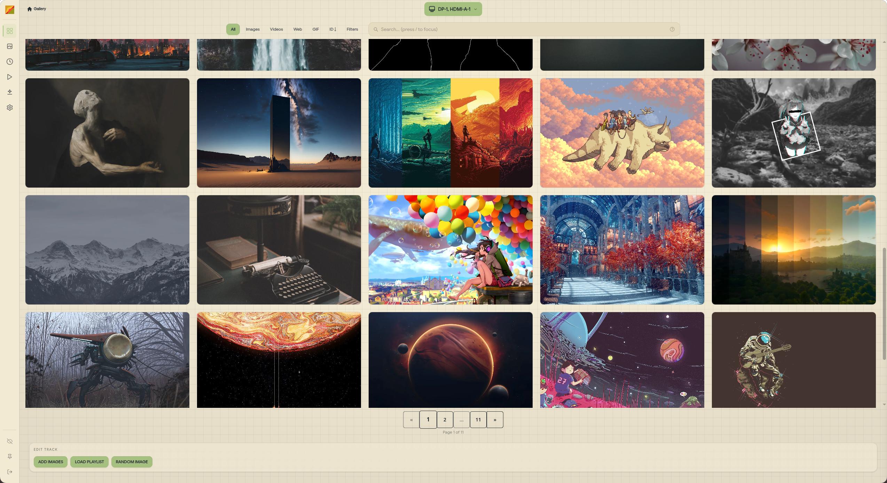

# The app (UI)

The app is an Electron shell around a React frontend. Navigation uses a hash router—six routes, each a full-screen view.

---

## Gallery

The main screen. Everything you do with wallpapers starts here.

**Importing:**

- Drag-and-drop **images**, **videos**, **folders**, or a **web wallpaper manifest** (`project.json`) directly onto the window.
- Click the **import button** in the toolbar to browse files.
- Paste an `https://` URL to import from the web (where the active backend supports it).
- Supported formats: JPG, PNG, GIF, WebP, BMP, SVG, TIFF (images); MP4, WebM, MKV, MOV (videos).
- Import progress is shown inline and reported live via SSE `processing_*` events.

<video src="../images/importing.webm" autoplay loop mute></video>

**Browsing:**

- Filter by **media type** (image, video, GIF, web), **tags**, **dominant colors**, or **folder**.
- **Color filter:** click swatches to filter by palette, or use perceptual matching (`colors_near`).
- **Search:** fuzzy name/tag search in the toolbar.
- **Sort:** by name, import date, or file size—ascending or descending. Persisted in config.

<video src="../images/browsing.webm" autoplay loop mute></video>
<!-- SCREENSHOT PLACEHOLDER: Gallery with filter panel open, showing tag filters and color swatches selected -->

**Setting a wallpaper:**

- **Double-click** any image to set it on the current monitor configuration.
- **Right-click** for the context menu: set on specific monitor, set random, move to folder, rename, add tags, delete.

**Selecting for playlists:**

- Hover an image to reveal a **checkbox** in the corner. Check multiple images, then open the playlist panel to add them to a new or existing playlist.

<!-- SCREENSHOT PLACEHOLDER: Gallery with 3 images checked, playlist creation panel open on the right -->

**Image detail:**

- Click the image name or use the context menu to open the detail sidebar.
- Edit **tags**, view **metadata** (dimensions, size, format, import date, colors).
- **Palette swatches** — click a swatch to seed a color filter; long-press / right-click deletes a swatch.
- **Rename on disk** — renames the file on disk and updates the database in one step.
- Footer is sticky: set / delete / save without scrolling.

**History navigation:**

- The history button (or the **History** route) shows a per-monitor log of every wallpaper change with source (manual, random, playlist). Navigate back and forward.

---

## Settings (`/settings`)

<!-- SCREENSHOT PLACEHOLDER: Settings modal with the four tab strip (General / Daemon / Backend / Wallhaven) -->

Settings open as a modal with four tabs: **General**, **Daemon**, **Backend**, **Wallhaven**. Changes save immediately and sync to the daemon via `PATCH /config`. See also [Configuration (TOML)](/guide/config) for the on-disk format and [Daemon & paths](/guide/daemon) for socket layout.

### General

The renderer-side tab. Four sub-sections.

**Theme & Appearance**

- **Theme** — DaisyUI preset list, or `system` to follow the OS dark/light setting.
- **Font preset** — bundled **Kolision**, bundled **Google Sans**, the OS UI stack, or `custom` (you supply CSS `font-family` strings).
- **UI Scale** — `compact` / `default` / `comfortable` / `large`. Scales the renderer including the sidebar rail and icons. Useful on HiDPI monitors or for accessibility.
- **Neobrutalist radius** — slider wired to the `--wp-radius-*` tokens; affects gallery cards, sidebar, and playlist track.

**Behavior**

| Setting                     | What it does                                                                         |
| --------------------------- | ------------------------------------------------------------------------------------ |
| Kill daemon on exit         | Stop the daemon when the Electron window closes. Default off (daemon keeps running). |
| Notifications               | Enable/disable desktop notifications.                                                |
| Start minimized             | Hide the window on launch (useful for autostart).                                    |
| Minimize instead of close   | Send to tray on window close button.                                                 |
| Show monitor modal on start | Pop the monitor selector every time the app opens.                                   |
| Startup intro               | Show the welcome animation on launch.                                                |

**Import**

- **Skip URL import warning** — suppress the warning dialog when pasting `https://` URLs into the gallery.

**Restore defaults**

- One-shot reset of daemon-side settings.

### Daemon

Daemon-owned knobs that round-trip through `PATCH /config`.

- **Monitors** — pick active outputs.
- **Image set type** — `individual` (per-monitor), `clone` (same image everywhere), or `extend` (one image sliced across all monitors by the daemon).
- **Images per page** — gallery pagination size (1–200).
- **Image history limit** — max wallpaper history entries before oldest are trimmed.
- **Sort defaults** — default field and direction for the gallery.

### Backend

Pick which backend sets your wallpaper. Backend list and capabilities come from [Backends & dependencies](/guide/backends); auto mode reads each backend's declared **`Capabilities`** (see [What changed in v3](/guide/whats-new#backend-surface-apply-capabilities)).

- **Type** — `awww`, `hyprpaper`, `feh`, `mpvpaper`, or `wal-qt`. Backends whose binary is missing on `PATH` are greyed out.
- **Selection mode**
  - `fixed` — always use the selected backend.
  - `auto` — pick the best available backend per media type, using priority lists.
- **Auto priority lists** — when `auto` is active, set ordered preference lists for images, videos, and web wallpapers independently.
- **Per-backend config** — each backend has its own panel (transitions for awww, mpv options for mpvpaper, etc.).

### Wallhaven

- **API key** — paste your Wallhaven API key for NSFW content and user collections. Leave blank for anonymous browsing.
- **Scroll mode** — `paginated` or `infinite` (auto-loads the next page).
- **Blur NSFW thumbnails** — blurs NSFW results in the route; unblurs on hover. Default on.

---

## Wallhaven (`/wallhaven`)

<!-- SCREENSHOT PLACEHOLDER: Wallhaven route with toolbar, filter row, and result grid showing resolution badges -->

Browse and download from [wallhaven.cc](https://wallhaven.cc) without leaving the app. The route mirrors the gallery's interaction model — set, download, or queue into a playlist directly from a card.

**Search & query**

- Wallhaven's full query syntax in the search bar (`#tag`, `-#tag`, etc.).
- **Sort:** date added, relevance, random, views, favorites, top list.
- **Categories** (General / Anime / People) and **Purity** (SFW / Sketchy / NSFW). NSFW requires an API key.

**Filters**

- **Ratios** — preset chips (16:9, 21:9, etc.) plus custom.
- **Colors** — pick from Wallhaven's swatch palette to filter by dominant color.
- **Hide saved** — hides any result already in your local gallery.

**Card features**

- **Resolution-match badge** — exact / good / poor vs. your largest monitor.
- **NSFW chip** + thumbnail **blur** (toggle in [Settings → Wallhaven](#wallhaven)) — unblurs on hover/focus.
- **In Gallery** chip when the image is already imported.
- Hover overlay exposes **Set wallpaper**, **Download to gallery**, and a **playlist** menu.

**Detail modal**

- Full-resolution image, modal scales to viewport.
- **Clickable tags** — click any tag to seed a fresh search for `#tagname`.
- Per-monitor **Set** popover, palette swatches with click-to-search.

**Scroll modes**

- `paginated` or `infinite` (configured in [Settings → Wallhaven](#wallhaven)).
- **Back-to-top** button appears once you scroll past the fold.

---

## History (`/history`)

<!-- SCREENSHOT PLACEHOLDER: History page showing a timeline of wallpaper changes, with monitor filter and thumbnails -->

Every wallpaper change is logged here: what was set, on which monitors, by what source (manual, random, playlist name). Filter by monitor or clear the log.

You can re-apply any historical wallpaper by clicking it.

---

## Looper Studio (`/loop-studio`) — beta

<!-- SCREENSHOT PLACEHOLDER: Looper Studio with a video loaded, in/out point sliders, and loop preview playing -->

**Set in/out points on videos** from your library and preview the loop in real-time. Optionally export the trimmed loop to a new file via **ffmpeg** (requires `ffmpeg` on `PATH`).

This is a beta feature—expect rough edges. The exported file can be imported back into the gallery.

---

## Shader Studio (`/shader-studio`) — beta

::: warning
 This function is beta, not all imported wallpapers will work out of the box,
you will have to do some tinkering on your own.
:::

<!-- SCREENSHOT PLACEHOLDER: Shader Studio with GLSL code editor on left and live WebGL2 preview on right -->

**Import Shadertoy JSON exports** (multipass shaders included) and preview them with a live **WebGL2** renderer. When you are happy with the result, save it as a **web wallpaper** package into the gallery—it shows up as a `web` media type image and can be set via the wal-qt backend.

Steps:

1. Export your shader from shadertoy.com as JSON.
2. Drag the JSON file into Shader Studio (or use the import button).
3. Tweak uniforms or code in the editor—preview updates live.
4. Click **Save to gallery** to package and import.

---

## Tray

Where the desktop environment supports a system tray, Waypaper Engine places a tray icon. Right-click it for quick actions: show/hide window, set random wallpaper, pause/resume playlist, quit.

---
